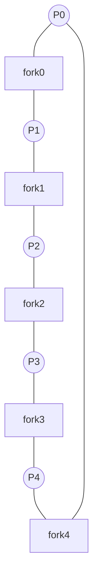

# Project: The Dining Philosophers

> Reproduce a real [deadlock](../1-knowledge/concurrency/deadlock.md) in a few seconds, watch
> it hang, then fix it with **lock ordering** — the single most useful deadlock-prevention
> technique, learned by feeling the failure first.

⏱️ ~30 min · 💰 free · 🐧 Linux/macOS · 🔧 C (pthreads)

## What you'll build
Five philosopher threads, five fork [mutexes](../1-knowledge/concurrency/locks-semaphores.md).
Each needs both neighboring forks to eat. The naive version deadlocks; you'll fix it two ways.



## Concepts you exercise
- [Deadlock & the four Coffman conditions](../1-knowledge/concurrency/deadlock.md)
- [Classic synchronization problems](../1-knowledge/concurrency/classic-problems.md)
- [Locks/mutexes](../1-knowledge/concurrency/locks-semaphores.md) and lock ordering

## Build it
**`philos.c`** — toggle `#define FIX` to switch between deadlocking and fixed versions:
```c
#include <pthread.h>
#include <stdio.h>
#include <unistd.h>

#define N 5
// #define FIX            // <-- uncomment to enable the lock-ordering fix

pthread_mutex_t fork_m[N];

void *philo(void *arg) {
    long id = (long)arg;
    int left = id, right = (id + 1) % N;

#ifdef FIX
    int first = left < right ? left : right;     // always lock LOWER-numbered fork first
    int second = left < right ? right : left;    // breaks the circular wait
#else
    int first = left, second = right;            // everyone grabs left, then right → deadlock
#endif

    for (int meal = 0; meal < 5; meal++) {
        printf("P%ld thinking\n", id);
        usleep(10000);
        pthread_mutex_lock(&fork_m[first]);
        printf("P%ld got fork %d\n", id, first);
        usleep(10000);                            // <- the window where everyone holds one fork
        pthread_mutex_lock(&fork_m[second]);
        printf("P%ld EATING (forks %d,%d)\n", id, first, second);
        usleep(10000);
        pthread_mutex_unlock(&fork_m[second]);
        pthread_mutex_unlock(&fork_m[first]);
    }
    printf("P%ld done\n", id);
    return NULL;
}

int main(void) {
    pthread_t t[N];
    for (int i = 0; i < N; i++) pthread_mutex_init(&fork_m[i], NULL);
    for (long i = 0; i < N; i++) pthread_create(&t[i], NULL, philo, (void*)i);
    for (int i = 0; i < N; i++) pthread_join(t[i], NULL);
    puts("all philosophers done");
    return 0;
}
```

## Run it — see the deadlock
```bash
cc -O2 -pthread -o philos philos.c     # FIX disabled
./philos
# ...each philosopher prints "got fork <left>" and then it HANGS forever:
#   every philosopher holds their left fork and waits for their right → circular wait.
# Ctrl-C to kill it. Confirm it's truly stuck (no "EATING" lines progress):
```

In another terminal, **prove** it's a deadlock, not slowness:
```bash
pstack $(pgrep philos)   # or: gdb -p <pid> then 'thread apply all bt'
# every thread is blocked in pthread_mutex_lock on the next fork — a textbook cycle.
```

## Fix it & re-run
```bash
cc -O2 -pthread -DFIX -o philos_fixed philos.c
./philos_fixed
# now everyone eats and you reach "all philosophers done" — no hang.
```

## What to observe & why
- The naive version satisfies **all four [Coffman conditions](../1-knowledge/concurrency/deadlock.md)**
  — mutual exclusion (forks), hold-and-wait (hold left, want right), no preemption (mutexes
  aren't taken back), and **circular wait** (P0→P1→P2→P3→P4→P0).
- The fix breaks exactly **one** condition — **circular wait** — by imposing a **global lock
  order** (always lock the lower-numbered fork first). One philosopher effectively becomes
  "left-handed," and the cycle can't close. This is the same trick as the
  [lock-ordered bank transfer](../1-knowledge/concurrency/deadlock.md).
- The `usleep` between grabbing the two forks *widens the race window* so the deadlock is
  reliable — real deadlocks hide in tiny windows and strike rarely, which is what makes them
  nasty.

## Break it differently / alternate fixes
- **Limit diners:** add a [counting semaphore](../1-knowledge/concurrency/locks-semaphores.md)
  initialized to `N-1` so at most 4 sit at once — breaks *hold-and-wait* at scale instead.
- **Trylock + backoff:** use `pthread_mutex_trylock` for the second fork; if it fails, drop the
  first and retry — breaks *no-preemption* (watch for [livelock](../1-knowledge/concurrency/deadlock.md)
  if everyone retries in lockstep).

## Extend it
- Add starvation detection (track meals per philosopher; ensure fairness).
- Reproduce it with your language's locks (Go, Java, Python) — the bug is universal.
- Run under `valgrind --tool=helgrind` to see it flag the inconsistent lock order *before* it
  even deadlocks.
