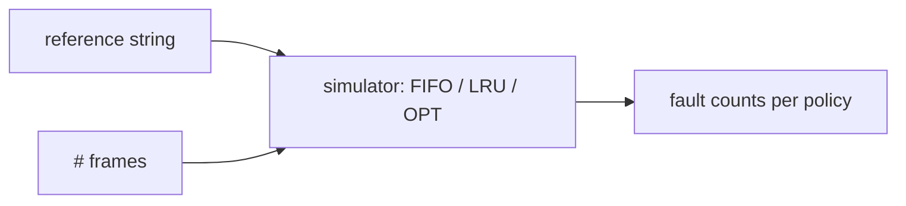

# Project: Page-Replacement Simulator

> Feed a page-reference string to FIFO, LRU, and Optimal; count the faults; and **witness
> Belady's anomaly** with your own eyes. The fastest way to internalize
> [page replacement](../1-knowledge/memory/page-replacement.md).

⏱️ ~30 min · 💰 free · 🐍 Python (any OS)

## What you'll build
A simulator that takes a reference string and a frame count, runs three policies, and reports
faults — plus a loop that demonstrates FIFO's anomaly.



## Concepts you exercise
- [Page replacement policies (FIFO, LRU, OPT)](../1-knowledge/memory/page-replacement.md)
- [Belady's anomaly](../1-knowledge/memory/page-replacement.md)
- [Paging & locality](../1-knowledge/memory/paging.md)
- [Demand paging & working set](../1-knowledge/memory/virtual-memory.md)

## Build it
**`pagesim.py`:**
```python
def fifo(refs, nframes):
    frames, faults, fifo_q = set(), 0, []
    for p in refs:
        if p not in frames:
            faults += 1
            if len(frames) >= nframes:
                victim = fifo_q.pop(0)          # evict oldest-loaded
                frames.remove(victim)
            frames.add(p); fifo_q.append(p)
    return faults

def lru(refs, nframes):
    frames, faults, recent = set(), 0, []       # recent: LRU order, last = most recent
    for p in refs:
        if p in frames:
            recent.remove(p); recent.append(p)  # touch → most recently used
        else:
            faults += 1
            if len(frames) >= nframes:
                victim = recent.pop(0)          # evict least recently used
                frames.remove(victim)
            frames.add(p); recent.append(p)
    return faults

def optimal(refs, nframes):
    frames, faults = set(), 0
    for i, p in enumerate(refs):
        if p not in frames:
            faults += 1
            if len(frames) >= nframes:
                # evict the page used FURTHEST in the future (or never)
                def next_use(pg):
                    try: return refs[i+1:].index(pg)
                    except ValueError: return float('inf')
                victim = max(frames, key=next_use)
                frames.remove(victim)
            frames.add(p)
    return faults

if __name__ == "__main__":
    refs = [1,2,3,4,1,2,5,1,2,3,4,5]
    for n in (3, 4):
        print(f"\n{n} frames, refs={refs}")
        print(f"  FIFO={fifo(refs,n)}  LRU={lru(refs,n)}  OPT={optimal(refs,n)}")

    # Belady's anomaly: FIFO faults can INCREASE with MORE frames
    print("\nBelady's anomaly (FIFO):")
    for n in range(1, 6):
        print(f"  frames={n}: FIFO faults={fifo(refs,n)}")
```

## Run it
```bash
python3 pagesim.py
# 3 frames: FIFO=9  LRU=10  OPT=7
# 4 frames: FIFO=10 LRU= ?  OPT= ?     <- FIFO got WORSE going 3→4 frames!
#
# Belady's anomaly (FIFO):
#   frames=3: 9
#   frames=4: 10     <- more memory, MORE faults. The anomaly, reproduced.
```

## What to observe & why
- **OPT is unbeatable but unbuildable** — it peeks at the future (`refs[i+1:]`). It's the
  *lower bound* you measure real policies against, not something an OS can implement.
- **LRU ≈ OPT on workloads with locality** because "recently used" predicts "soon used." Try a
  looping access pattern and a random one — LRU shines on the former, struggles on the latter.
- **Belady's anomaly**: FIFO can fault *more* with *more* frames — deeply counterintuitive and
  the reason FIFO is a bad policy. LRU and OPT are **stack algorithms** and never suffer it
  (verify by running the anomaly loop with `lru`).
- Map this back to reality: faults here = [major page faults](../1-knowledge/memory/paging.md)
  that hit disk; minimizing them is what [Linux's two-list LRU](../2-case-studies/linux-virtual-memory.md)
  approximates.

## Break it / explore
- Make the reference string have **no locality** (random) → all policies converge toward
  faulting on nearly every access (approaching the [thrashing](../1-knowledge/memory/page-replacement.md)
  regime).
- Add **Clock (second-chance)** — a circular buffer with a reference bit — and confirm it
  tracks LRU closely at a fraction of the cost (this is what real kernels actually use).
- Plot faults vs frame count for each policy to see the working-set "knee."

## Extend it
- Add **LFU** and **MRU**; compare on different patterns.
- Generate reference strings from a real program's access trace (e.g. via `valgrind --tool=lackey`).
- Add **dirty-bit accounting** — count write-backs, not just faults (clean evictions are free).
