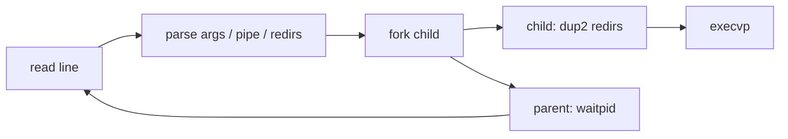

# Project: Write a Unix Shell

> Build a working shell to *feel* how every command runs: `fork` a child, `exec` the program,
> `wait` for it — plus pipes and redirection with raw file descriptors. This is the
> [process lifecycle](../1-knowledge/processes-scheduling/process-lifecycle.md) made real.

⏱️ ~45 min · 💰 free · 🐧 Linux/macOS · 🔧 C

## What you'll build
A REPL shell that runs commands, handles `cmd args`, a single pipe `a | b`, and `>`/`<`
redirection — the core of bash in ~120 lines.



## Concepts you exercise
- [`fork`/`exec`/`wait`](../1-knowledge/processes-scheduling/process-lifecycle.md) — the
  process creation cycle
- [File descriptors & pipes](../1-knowledge/processes-scheduling/ipc.md) — `dup2`, `pipe`
- [System calls](../1-knowledge/fundamentals/system-calls.md) — every action is one
- [Process vs thread](../1-knowledge/fundamentals/process-vs-thread.md) — why a child is a
  separate address space

## Build it
**`tinysh.c`:**
```c
#include <stdio.h>
#include <stdlib.h>
#include <string.h>
#include <unistd.h>
#include <fcntl.h>
#include <sys/wait.h>

#define MAXARG 32
static int split(char *s, char **argv) {        // whitespace tokenizer
    int n = 0;
    for (char *t = strtok(s, " \t\n"); t && n < MAXARG-1; t = strtok(NULL, " \t\n"))
        argv[n++] = t;
    argv[n] = NULL;
    return n;
}

static void run(char *cmd) {                     // run one command, with < > redirs
    char *argv[MAXARG];
    char *in = NULL, *out = NULL, *p;
    if ((p = strchr(cmd, '<'))) { *p = 0; in  = strtok(p+1, " \t\n"); }
    if ((p = strchr(cmd, '>'))) { *p = 0; out = strtok(p+1, " \t\n"); }
    if (split(cmd, argv) == 0) return;
    if (in)  { int fd = open(in,  O_RDONLY);            dup2(fd, 0); close(fd); }
    if (out) { int fd = open(out, O_WRONLY|O_CREAT|O_TRUNC, 0644); dup2(fd, 1); close(fd); }
    execvp(argv[0], argv);                        // replaces this process image
    perror(argv[0]); _exit(127);                  // only if exec failed
}

int main(void) {
    char line[1024];
    while (printf("tinysh$ "), fflush(stdout), fgets(line, sizeof line, stdin)) {
        if (strncmp(line, "exit", 4) == 0) break;
        char *bar = strchr(line, '|');
        if (bar) {                                 // a | b  → wire a pipe
            *bar = 0;
            int fd[2]; pipe(fd);
            if (fork() == 0) { dup2(fd[1],1); close(fd[0]); close(fd[1]); run(line);   }
            if (fork() == 0) { dup2(fd[0],0); close(fd[0]); close(fd[1]); run(bar+1);  }
            close(fd[0]); close(fd[1]);
            wait(NULL); wait(NULL);
        } else {                                   // single command
            pid_t pid = fork();
            if (pid == 0) run(line);
            else waitpid(pid, NULL, 0);
        }
    }
    return 0;
}
```

## Run it
```bash
cc -O2 -o tinysh tinysh.c
./tinysh
tinysh$ ls -l
tinysh$ echo hello > out.txt
tinysh$ cat < out.txt
tinysh$ ls | wc -l
tinysh$ exit
```

## What to observe & why
- **`fork` returns twice** — 0 in the child (which `exec`s) and the PID in the parent (which
  `wait`s). The child is a *copy* with its own address space.
- **`execvp` never returns on success** — it *replaces* the program; the line after it runs
  only on failure. This is why the shell `fork`s first: it must survive to read the next command.
- **Redirection is just `dup2`** — point fd 0/1 at a file *before* `exec`, and the unmodified
  program reads/writes the file without knowing. This is the "everything is a file descriptor"
  idea in action.
- **A pipe is a kernel buffer** ([IPC](../1-knowledge/processes-scheduling/ipc.md)): `ls`'s
  stdout connects to `wc`'s stdin; the kernel blocks the writer when full and the reader when
  empty (backpressure for free).

## Break it
- Remove the `waitpid` → children become [zombies](../1-knowledge/processes-scheduling/process-lifecycle.md);
  watch them with `ps aux | grep defunct`.
- Forget to `close` unused pipe ends → `wc -l` hangs forever (it never sees EOF because the
  write end is still open in some process). A classic, instructive bug.

## Extend it
- Multiple pipes (`a | b | c`) — loop, chaining pipes.
- Background jobs (`cmd &`) — don't `wait`; reap with `SIGCHLD`.
- Built-ins that must run in the parent (`cd` — a child `cd` can't change the parent's dir).
- Signal handling so Ctrl-C kills the child, not the shell.
