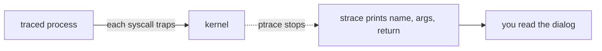

# Project: Observe Syscalls with strace

> Watch any program's entire conversation with the kernel. `strace` makes the invisible
> [system-call boundary](../1-knowledge/fundamentals/system-calls.md) visible — every
> `open`, `read`, `write`, `mmap`, and `clone` a process makes.

⏱️ ~20 min · 💰 free · 🐧 Linux (macOS: `dtruss`) · 🔧 strace

## What you'll build
Not code — *insight*. You'll trace real programs and learn to read the user↔kernel dialog,
then use it to debug a "permission denied" mystery.



## Concepts you exercise
- [System calls](../1-knowledge/fundamentals/system-calls.md) — the only doorway into the kernel
- [User vs kernel space](../1-knowledge/fundamentals/kernel-user-space.md) — every line is a crossing
- [Process lifecycle](../1-knowledge/processes-scheduling/process-lifecycle.md) — see
  `execve`/`clone`/`wait`
- [File systems](../1-knowledge/storage-fs/file-systems.md) — `openat`/`stat`/`read` against the VFS

## Run it
```bash
# 1. The simplest program makes surprisingly many syscalls:
strace -f echo hello 2>&1 | head -40
#   execve(...)            ← the program starts
#   brk(...), mmap(...)    ← libc sets up the heap & maps the C library
#   openat("/etc/ld.so.cache"...), openat("libc.so.6"...)  ← dynamic linker
#   write(1, "hello\n", 6) ← the ONE line that is your program
#   exit_group(0)

# 2. Count & summarize syscalls (great for "where is time going?"):
strace -c ls /usr >/dev/null
#   shows a table: % time, calls, errors per syscall

# 3. Filter to just file opens, with timestamps:
strace -e trace=openat -tt cat /etc/hostname

# 4. Attach to an ALREADY-RUNNING process by PID:
strace -p $(pgrep -n bash) -e trace=read,write
```

## What to observe & why
- **`echo hello` makes ~25 syscalls**, but only **one** (`write`) is "your" work. The rest is
  `execve` + the dynamic linker `mmap`ing libc + heap setup. This is the real cost of starting
  a process you never see — and why [context switches](../1-knowledge/processes-scheduling/context-switching.md)
  and process startup aren't free.
- **`printf` ≠ one `write` per call** — libc buffers in user space and flushes with a single
  `write`. Trace a program that prints a lot to see batching (and why a crash can lose buffered
  output that never reached the kernel).
- **Every file access is `openat` + `read`/`fstat`** against the
  [VFS](../1-knowledge/storage-fs/file-systems.md) — the syscall layer is uniform across ext4,
  tmpfs, NFS.
- **`-c` reveals hotspots** — a slow program dominated by millions of tiny `read`s is a
  candidate for buffering or [`io_uring`](../1-knowledge/storage-fs/io-systems.md).

## Debug a real mystery
```bash
# A program fails with a vague error. strace shows the exact failing syscall + errno:
strace -f ./flaky 2>&1 | grep -E 'ENOENT|EACCES|= -1'
#   openat("/etc/app/config.yaml", O_RDONLY) = -1 ENOENT (No such file or directory)
#   ^ it's looking in the WRONG PATH — instantly obvious, no source code needed
```
This is strace's superpower: when an app "just fails," the kernel dialog shows *exactly* which
file/socket/permission it tripped on.

## Break it / push it
- `strace` slows the target a lot (every syscall stops it via `ptrace`) — time `strace ./prog`
  vs `./prog` to feel the [user/kernel crossing](../1-knowledge/fundamentals/kernel-user-space.md)
  cost amplified.
- Trace a network program with `-e trace=network` to watch `socket`/`connect`/`sendto`.
- Compare `strace` (syscalls) vs `ltrace` (library calls) on the same program to see the two
  layers.

## Extend it
- Use `perf trace` (lower overhead) or **bpftrace** for syscall tracing at scale.
- Write a 30-line `ptrace`-based tracer yourself (`PTRACE_TRACEME` + `PTRACE_SYSCALL`) to see
  how strace works under the hood.
- Trace your [tiny shell](./project-shell.md) with `strace -f` and watch `clone`/`execve`/`wait`
  fire for each command.
