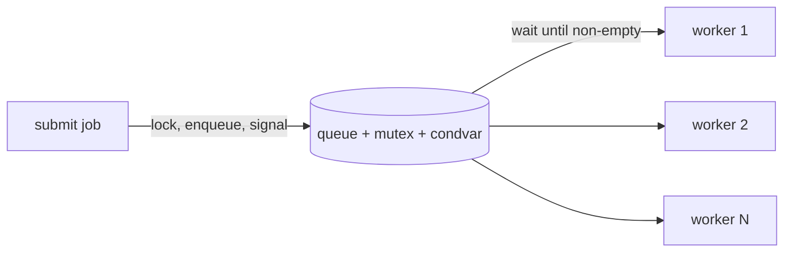

# Project: Build a Thread Pool

> N worker threads pull tasks from one shared queue. Building it forces you to use a
> [mutex + condition variable](../1-knowledge/concurrency/locks-semaphores.md) correctly and
> implements the [producer–consumer](../1-knowledge/concurrency/classic-problems.md) pattern
> by hand.

⏱️ ~40 min · 💰 free · 🐧 Linux/macOS · 🔧 C (pthreads)

## What you'll build
A fixed pool of worker threads and a thread-safe job queue. You submit functions; idle
workers block (no busy-waiting) until work arrives, then run it.



## Concepts you exercise
- [Mutexes & condition variables](../1-knowledge/concurrency/locks-semaphores.md) — the `while`
  + `cond_wait` idiom
- [Producer–consumer](../1-knowledge/concurrency/classic-problems.md) — the canonical pattern
- [Race conditions](../1-knowledge/concurrency/race-conditions.md) — what the lock prevents
- [Threads](../1-knowledge/processes-scheduling/threads.md) — 1:1 kernel threads sharing memory

## Build it
**`pool.c`:**
```c
#include <pthread.h>
#include <stdio.h>
#include <stdlib.h>
#include <unistd.h>

typedef struct Job { void (*fn)(int); int arg; struct Job *next; } Job;

static Job *head, *tail;
static pthread_mutex_t m = PTHREAD_MUTEX_INITIALIZER;
static pthread_cond_t  cv = PTHREAD_COND_INITIALIZER;
static int stop = 0;

static void submit(void (*fn)(int), int arg) {
    Job *j = malloc(sizeof *j);
    *j = (Job){ fn, arg, NULL };
    pthread_mutex_lock(&m);
    if (tail) tail->next = j; else head = j;     // enqueue
    tail = j;
    pthread_cond_signal(&cv);                    // wake one idle worker
    pthread_mutex_unlock(&m);
}

static void *worker(void *id) {
    for (;;) {
        pthread_mutex_lock(&m);
        while (!head && !stop)                   // WHILE, not if — recheck on wakeup
            pthread_cond_wait(&cv, &m);          // atomically unlock + sleep
        if (stop && !head) { pthread_mutex_unlock(&m); break; }
        Job *j = head; head = j->next; if (!head) tail = NULL;   // dequeue
        pthread_mutex_unlock(&m);                // run OUTSIDE the lock
        j->fn(j->arg);
        free(j);
    }
    printf("worker %ld exiting\n", (long)id);
    return NULL;
}

static void task(int n) { printf("  task %d on tid %lu\n", n, (unsigned long)pthread_self());
                          usleep(100000); }

int main(void) {
    enum { N = 4 };
    pthread_t t[N];
    for (long i = 0; i < N; i++) pthread_create(&t[i], NULL, worker, (void*)i);
    for (int i = 0; i < 20; i++) submit(task, i);    // 20 jobs, 4 workers
    sleep(1);                                         // let them drain
    pthread_mutex_lock(&m); stop = 1; pthread_cond_broadcast(&cv); pthread_mutex_unlock(&m);
    for (int i = 0; i < N; i++) pthread_join(t[i], NULL);
    return 0;
}
```

## Run it
```bash
cc -O2 -pthread -o pool pool.c
./pool
# 20 tasks are distributed across 4 worker threads (note the differing tids),
# ~4 running at a time, then all 4 workers print "exiting".
```

## What to observe & why
- **Idle workers use 0% CPU** — `pthread_cond_wait` *blocks* them (the scheduler runs nothing
  for them) instead of spinning. That's the whole point of a condition variable vs a busy loop.
- **`signal` wakes one, `broadcast` wakes all** — submit wakes a single worker; shutdown
  broadcasts so every worker re-checks `stop` and exits.
- **`while` not `if`** — when a worker wakes, another worker may have already taken the job, so
  it must re-check `head`. With `if` you'd dequeue from an empty queue (a crash/race).
- **The job runs *outside* the lock** — hold the mutex only to touch the shared queue; doing
  work while holding it would serialize all workers (destroying parallelism — a classic
  lock-granularity mistake).

## Break it
- Change `while` to `if` and add more workers → occasional crash/garbage from dequeuing empty.
- Run the increment-a-shared-counter task *without* a lock around it → see the
  [lost-update race](../1-knowledge/concurrency/race-conditions.md); confirm with
  `cc -fsanitize=thread`.
- Remove the `pthread_mutex_unlock` before `j->fn()` → workers serialize; throughput collapses
  to one-at-a-time.

## Extend it
- **Bounded queue** with backpressure: add a second condition variable (`not_full`) so
  `submit` blocks when the queue is full — full producer/consumer.
- Return **futures** (a result + its own condvar) so callers can `wait` for a job's result.
- Compare with a [semaphore](../1-knowledge/concurrency/locks-semaphores.md)-based version.
- This *is* how real server thread pools (and your language runtime's executor) work.
