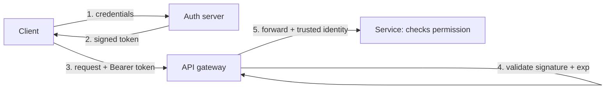

# Authentication & Authorization

> Two questions every request must answer: **who are you** (authentication) and **are you allowed
> to do this** (authorization). Getting them right — once, cheaply, across many services — is the
> backbone of every secure system.

## Problem
A login proves identity *once*, but the system must re-establish "who is this and what may they do"
on **every** subsequent request — across many stateless servers, without re-checking a password each
time, and without trusting anything the client says about itself. Do it wrong and you get the
internet's most common breaches: broken access control and stolen credentials
([OWASP](../../../best-practices/1-knowledge/security/secure-coding.md) #1). The building block is a
way to carry *proven* identity on each request and check permissions at the right place.

## Core concepts

**AuthN ≠ AuthZ.** *Authentication* establishes identity (login). *Authorization* decides what that
identity may do (this user can read order 7 but not delete it). They fail differently: no/invalid
identity → **401 Unauthorized**; valid identity lacking permission → **403 Forbidden**.

**Carrying identity: sessions vs. tokens.** After login you need a credential the client replays:
- **Server-side sessions** — the server stores session state and hands the client an opaque
  **session ID** (usually a cookie). Every request, the server looks it up. Easy to **revoke**
  (delete the row), but **stateful**: the store (Redis) must be shared across all instances.
- **Tokens (JWT)** — a signed, **self-contained** token the client holds. The server validates the
  signature and reads the claims (`sub`, `exp`, `scope`) — **no lookup, stateless**, scales
  horizontally. Cost: you can't easily revoke one before it expires → keep them **short-lived** and
  pair with a long-lived **refresh token**.

**OAuth2 & OIDC — delegated access.** "Sign in with Google" without giving Google your app's
password. **OAuth2** is an *authorization* framework: an auth server issues scoped **access tokens**
so a client can act on a user's behalf (the authorization-code flow). **OIDC** adds an
*authentication* layer on top — an **ID token** that says *who the user is*. Rule of thumb: OAuth2 =
"what may this app access," OIDC = "who logged in."

**Where it lives (the system-design decision).** Authenticate **once at the edge** — the
[API gateway](./proxies-gateways.md) validates the token and forwards a trusted identity header to
internal services; services then do **authorization** near the resource they protect. Centralizing
authN keeps every service from re-implementing it; keeping authZ local keeps permission logic next
to the data.

**Authorization models.** **RBAC** (permissions via roles — admin/editor/viewer), **ABAC**
(rules over attributes — "owner can edit during business hours"), **ACL** (per-object allow lists).



## Example
A stateless JWT bearer flow. The client sends the token on every call; the gateway validates it
without any database lookup:

```http
POST /login            →  200 { "access_token": "eyJhbGci...", "expires_in": 900 }
GET  /orders/7
Authorization: Bearer eyJhbGci...
```
The token's middle segment (base64, **not** encrypted — never put secrets in it) decodes to:
```json
{ "sub": "user_42", "scope": "orders:read", "exp": 1718130000 }
```
The gateway checks the **signature** (proves the auth server issued it) and **`exp`** (not expired),
then forwards `X-User: user_42`. The order service sees `scope: orders:read` and allows the GET but
would `403` a DELETE. No session store touched — which is exactly why JWTs scale, and why a stolen
token is valid until `exp` (hence short lifetimes + refresh).

## Common tools
| Tool | What it is | Use it for |
| --- | --- | --- |
| **Auth0 / Okta / AWS Cognito** | Managed identity providers | outsourcing login, OAuth/OIDC, MFA |
| **Keycloak** | Self-hosted OIDC/OAuth server | running your own auth |
| **JWT libraries** (`jsonwebtoken`, PyJWT) | Sign/verify tokens | issuing & validating tokens |
| **API gateway authorizers** (Kong, Envoy, AWS API GW) | Edge token validation | authenticate once at the edge |
| **OPA / Cedar** | Policy engines | externalized ABAC/RBAC authorization |
| **[AWS IAM](../../../devops-infrastructure/1-knowledge/cloud/aws-iam.md)** | Cloud authZ | machine-to-machine & infra permissions |

## Trade-offs
- ✅ **Sessions**: trivial revocation, smaller credential, server controls everything — ⚠️ stateful,
  needs a shared/sticky store, an extra lookup per request.
- ✅ **JWT/stateless**: no lookup, scales across instances, works for service-to-service — ⚠️ near-
  impossible to revoke early, larger per request, and footguns abound (`alg:none`, leaking secrets in
  the readable payload, skipping `exp`).
- **Non-negotiables**: everything over [TLS](../../../computer-networks/1-knowledge/security/tls-https.md)
  (a token on plain HTTP is a password in the clear); store tokens safely (HttpOnly cookies vs.
  localStorage XSS risk); always verify signature *and* expiry; prefer short tokens + refresh.
- Don't roll your own crypto or login — use a vetted provider; auth bugs are catastrophic and subtle.

## Real-world examples
- **"Sign in with Google/GitHub"** is OAuth2 + OIDC; **Stripe/GitHub API keys & PATs** are the
  token model for machine clients.
- **AWS** splits it cleanly: **Cognito** for end-user auth, **[IAM](../../../devops-infrastructure/1-knowledge/cloud/aws-iam.md)**
  for service/infra authorization — the same authN/authZ divide at cloud scale.

## References
- [API gateway](./proxies-gateways.md) (where auth lives) · [REST API design](../communication/rest.md) · [TLS & HTTPS](../../../computer-networks/1-knowledge/security/tls-https.md) · [Secure coding](../../../best-practices/1-knowledge/security/secure-coding.md)
- [OWASP Authentication Cheat Sheet](https://cheatsheetseries.owasp.org/cheatsheets/Authentication_Cheat_Sheet.html) · [The OAuth 2.0 framework (RFC 6749)](https://datatracker.ietf.org/doc/html/rfc6749)
