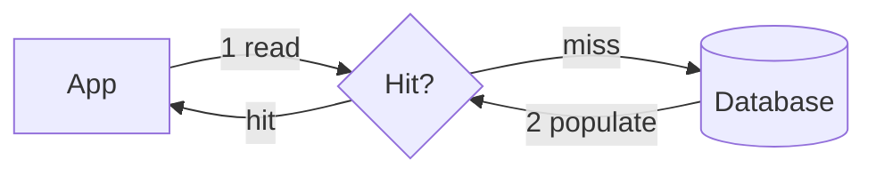

# Caching Strategies

> A cache is a fast, temporary store of frequently accessed data, placed close to the
> consumer to cut latency and reduce load on the source of truth.

## Problem
Databases and downstream services are slow and expensive relative to memory. If the
same data is read often, recomputing or refetching it every time wastes time and
capacity. Caching trades a little staleness for a lot of speed.

## Core concepts

**Where caches live (every layer)**
- Browser / client cache → CDN → reverse-proxy cache → application cache (in-memory) →
  distributed cache (Redis/Memcached) → database buffer cache.

**Read strategies**
- **Cache-aside (lazy loading)** — app checks cache; on miss, reads DB and populates
  cache. Most common. Cache only holds what's actually requested.
- **Read-through** — the cache library fetches from DB on a miss transparently.

**Write strategies**
- **Write-through** — write to cache *and* DB synchronously. Cache always fresh,
  writes slower.
- **Write-back (write-behind)** — write to cache, flush to DB async. Fast writes, risk
  of data loss if cache dies before flush.
- **Write-around** — write straight to DB, skip cache. Avoids caching write-only data.

**Eviction policies** — when full, what to drop: **LRU** (least recently used, common),
LFU, FIFO, TTL-based expiry.

**The classic problems**
- **Stale data** — cache and DB disagree → use TTLs and/or invalidation on write.
- **Cache stampede / thundering herd** — a hot key expires and thousands of requests
  hit the DB at once → mitigate with locks, request coalescing, or staggered TTLs.
- **Hot keys** — one key gets disproportionate traffic → replicate or shard it.

## Trade-offs
- More caching = faster + cheaper reads, but more **staleness** and **invalidation
  complexity** ("there are only two hard things… cache invalidation").
- Write-back is fastest but least durable; write-through is safest but slower.

## Real-world examples
- **Redis / Memcached** as a shared cache tier in front of databases.
- **CDNs** cache static assets at the edge (see [CDN](./cdn.md)).

## References
- [Redis caching patterns](https://redis.io/docs/manual/patterns/)
- *Designing Data-Intensive Applications*
