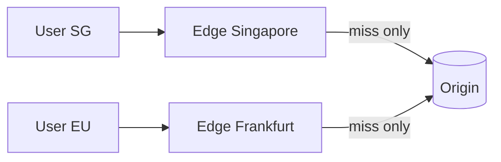

# Content Delivery Networks (CDN)

> A CDN is a geographically distributed network of edge servers that cache content
> close to users, cutting latency and offloading your origin.

## Problem
If your servers are in Virginia and a user is in Singapore, every request crosses the
planet (~200ms+ round trip) and hammers your origin. For static assets (images, JS,
video) that's wasteful — the bytes are identical for everyone.

## Core concepts

**How it works** — the CDN has **Points of Presence (PoPs)** worldwide. A user is
routed (via DNS/anycast) to the nearest PoP, which serves cached content or fetches it
from origin once and caches it.

**Push vs pull**
- **Pull CDN** — CDN fetches from origin on first request, then caches (TTL-based).
  Easy; good for frequently changing or large catalogs.
- **Push CDN** — you upload content to the CDN ahead of time. Good for large, rarely
  changing files; you control what's stored.

**What to put on a CDN** — static assets, images, video, CSS/JS, downloads, and
increasingly **dynamic content** via edge caching and **edge compute** (run code at
the PoP).

**Cache control** — `Cache-Control`/`Expires` headers and **cache keys** decide what's
cached and for how long. **Cache busting** (versioned filenames like `app.a1b2.js`)
forces refresh on deploy.

## Trade-offs
- Massive latency + origin-load reduction, but: **stale content** until TTL/expiry or
  explicit **purge**; extra cost; harder to cache personalized/dynamic responses.
- Cache invalidation across hundreds of PoPs takes time — design URLs for versioning.

## Real-world examples
- **Cloudflare, Akamai, AWS CloudFront, Fastly** serve a large fraction of internet
  traffic.
- **Netflix Open Connect** places CDN appliances inside ISPs to stream video from
  within the user's own network.

## References
- [What is a CDN? (Cloudflare)](https://www.cloudflare.com/learning/cdn/what-is-a-cdn/)
- [Netflix Open Connect](https://openconnect.netflix.com/)
