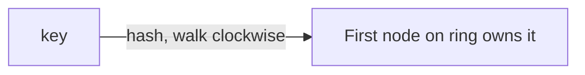

# Consistent Hashing

> A hashing technique that maps both data and nodes onto a ring, so that adding or
> removing a node moves only a small fraction of keys instead of remapping everything.

## Problem
To spread data across N servers, the naive approach is `server = hash(key) % N`. It
works until N changes: add or remove one server and **almost every key** remaps to a
different server, causing a massive cache miss storm or data reshuffle.

## Core concepts

**The ring** — imagine a circle of hash values 0 … 2³²−1. Hash each **node** to a
point on the ring. To place a **key**, hash it and walk clockwise to the first node.

**Why it helps** — when a node is added or removed, only the keys between it and the
previous node move. On average just **K/N keys** relocate (K = keys, N = nodes),
instead of nearly all of them.

**Virtual nodes** — one physical node is placed at *many* points on the ring (e.g.
100–200 virtual nodes each). This:
- Smooths out **uneven distribution** (without it, some nodes get far more keys).
- Spreads a failed node's load across *many* remaining nodes, not just its neighbor.
- Lets you weight bigger machines (give them more virtual nodes).

## Trade-offs
- Adds implementation complexity vs simple modulo, but is essential for systems where
  membership changes often (caches, distributed DBs).
- Virtual nodes fix balance but use more memory/metadata.
- Doesn't by itself solve **hot keys** (one popular key still lands on one node) —
  needs replication of that key.

## Real-world examples
- **Amazon DynamoDB** and **Apache Cassandra** use consistent hashing to partition
  data across nodes.
- **Memcached client libraries** and **CDNs** use it to pick a cache server so adding
  capacity doesn't flush the whole cache.

## References
- Karger et al., *Consistent Hashing and Random Trees* (1997)
- [Amazon Dynamo paper](https://www.allthingsdistributed.com/files/amazon-dynamo-sosp2007.pdf)
