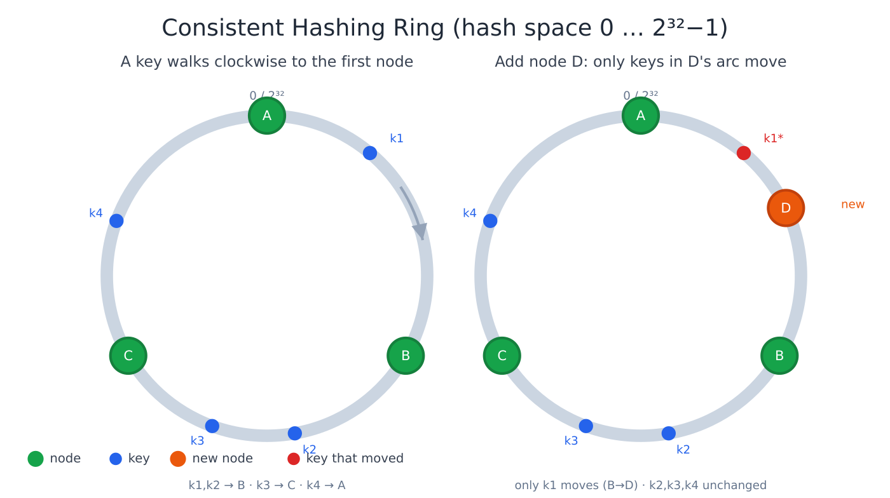
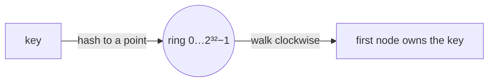

# Consistent Hashing

> A hashing technique that maps both data and nodes onto a ring, so that adding or
> removing a node moves only a small fraction of keys instead of remapping everything.

## Problem
To spread data across N servers, the naive approach is `server = hash(key) % N`. It
works until N changes: add or remove one server and **almost every key** remaps to a
different server, causing a massive cache miss storm or data reshuffle.

Concretely, with `% N` the server for a key depends on N itself, so changing N changes
the answer for nearly all keys at once. For a 1,000-node cache, losing one node would
invalidate roughly **999/1000** of all cached entries — the database behind it gets hit
by the full traffic at the same instant (a "thundering herd").

## Core concepts

**The ring** — imagine a circle of hash values 0 … 2³²−1 (the output range of the hash,
joined end to end so the largest value wraps back to 0). Hash each **node** (by its id
or IP) to a point on the ring. To place a **key**, hash it to a point and walk
**clockwise** to the first node you meet — that node owns the key.





**Why it helps** — a node only owns the arc between itself and the **previous** node on
the ring. So when a node is added or removed, only the keys in *that one arc* change
hands; every other arc is untouched. On average just **K/N keys** relocate (K = keys,
N = nodes) instead of nearly all of them.

- **Add a node:** it splits one existing arc in two and takes over the keys in its half.
  Only those keys move (see the right-hand ring above — adding **D** moves only **k1**).
- **Remove a node:** its arc merges into the next node clockwise, which inherits exactly
  that node's keys. No other node is affected.

**Virtual nodes (vnodes)** — placing each physical node at a single point makes the ring
lumpy: by chance one node can end up owning a huge arc. The fix is to hash each physical
node to *many* points on the ring (e.g. 100–200 virtual nodes each, often as
`hash(node_id + ":" + i)`). This:
- Smooths out **uneven distribution** — many small arcs per node average out, so each
  node's total share converges to ~1/N.
- Spreads a failed node's load across **many** remaining nodes instead of dumping it all
  on its single clockwise neighbor.
- Lets you **weight** machines: give a bigger box more virtual nodes and it owns
  proportionally more of the ring.

The cost: more metadata to track (one ring entry per vnode) and a slightly bigger
lookup structure.

## How a lookup works
1. Keep the occupied ring positions in a **sorted structure** (a sorted array or
   balanced tree / `TreeMap`), each mapping a hash position → node.
2. For a key, compute `h = hash(key)`.
3. **Binary-search** for the smallest position ≥ `h` (the first node clockwise). If `h`
   is past the last position, **wrap around** to the first position. That's the owner.

Lookup is **O(log V)** where V = total virtual nodes. For replication, keep walking
clockwise and pick the next **R distinct physical** nodes — that gives a natural
replica set for each key (this is exactly how Dynamo/Cassandra choose replicas).

## Example — adding a node moves few keys
Distribute 10,000 keys over 3 nodes, then add a 4th:
- **`hash(key) % N`:** going from `%3` to `%4` changes the result for **~75%** of keys → a
  near-total reshuffle (cache-miss storm).
- **Consistent hashing:** only the keys that now fall to the new node's ring segment move —
  **~25% (≈ K/N)**. Everyone else stays put.

Virtual nodes keep each node's share even (~25% each). You can measure both in a few lines of
Python — it underpins the [key-value store case study](../../2-case-studies/key-value-store.md).

```python
import hashlib, bisect

def h(s): return int(hashlib.md5(s.encode()).hexdigest(), 16)

class Ring:
    def __init__(self, nodes, vnodes=100):
        self.v = vnodes
        self.ring = {}                       # position -> node
        for n in nodes: self.add(n)
    def add(self, node):
        for i in range(self.v):
            self.ring[h(f"{node}:{i}")] = node
        self._keys = sorted(self.ring)
    def get(self, key):
        p = bisect.bisect(self._keys, h(key))
        return self.ring[self._keys[p % len(self._keys)]]  # wrap around

r = Ring(["A", "B", "C"])
before = {k: r.get(k) for k in map(str, range(10000))}
r.add("D")
moved = sum(before[k] != r.get(k) for k in before)
print(moved / 10000)   # ≈ 0.25 — only ~K/N keys move
```

## Common tools
| Tool | Uses consistent hashing for |
| --- | --- |
| **Apache Cassandra**, **DynamoDB**, **ScyllaDB**, **Riak** | partitioning data across nodes (with virtual nodes) |
| **libketama / libmemcached** | spreading keys across Memcached servers |
| **Envoy** (`ring_hash`), **HAProxy**, **NGINX** (`hash … consistent`) | sticky/affinity load balancing |
| **Google Maglev**, **"consistent hashing with bounded loads"** | LB variants that also cap per-node overload |

## Trade-offs
- Adds implementation complexity vs simple modulo, but is essential for systems where
  membership changes often (caches, distributed DBs).
- Virtual nodes fix balance but use more memory/metadata.
- Doesn't by itself solve **hot keys** (one popular key still lands on one node) —
  needs replication or splitting of that key.
- Plain consistent hashing bounds the *number* of keys that move, not the *load*: a node
  can still get unlucky and run hot. **Bounded-load** variants (and Maglev) add a cap so
  no node exceeds ~(1+ε)·average, spilling overflow to the next node.

## Real-world examples
- **Amazon DynamoDB** and **Apache Cassandra** use consistent hashing to partition
  data across nodes, and walk clockwise to pick the **N replicas** for each key.
- **Memcached client libraries** (ketama) and **CDNs** use it to pick a cache server so
  adding capacity doesn't flush the whole cache.
- **Google Maglev** load balancer uses a consistent-hashing variant so connections stay
  pinned to the same backend even as the backend pool changes.

## References
- Karger et al., *Consistent Hashing and Random Trees* (1997)
- [Amazon Dynamo paper](https://www.allthingsdistributed.com/files/amazon-dynamo-sosp2007.pdf)
- [Maglev: A Fast and Reliable Software Network Load Balancer](https://research.google/pubs/pub44824/) (2016)
- [Consistent Hashing with Bounded Loads](https://research.google/blog/consistent-hashing-with-bounded-loads/) (Google, 2017)
