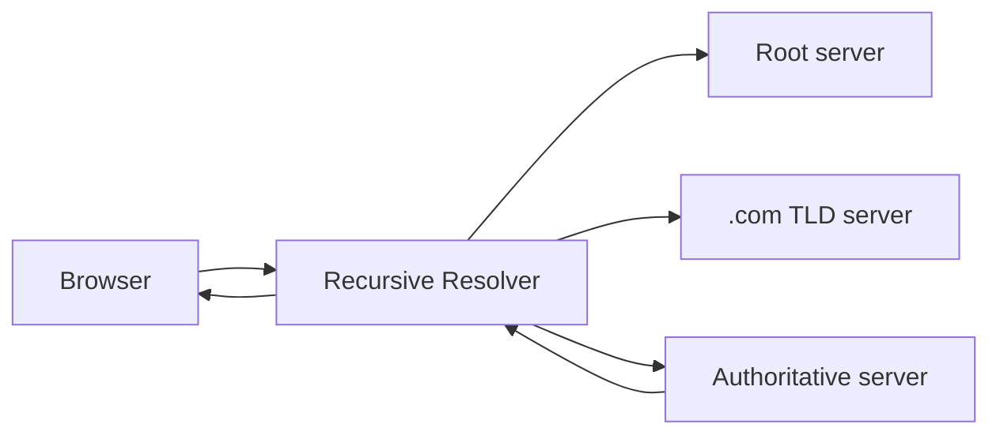

# DNS & the Lifecycle of a Request

> DNS turns a human name (`example.com`) into an IP address; the request lifecycle is
> the full journey from typing a URL to rendering a response.

## Problem
Computers route by IP, but humans use names. And a single page load triggers a chain
of lookups, connections, and hops. Understanding the path shows you *where* latency
and failure can occur.

## Core concepts

**DNS resolution** — name → IP, via a hierarchy of resolvers:

Results are **cached** at every layer (browser, OS, resolver) with a **TTL** to avoid
repeating the lookup.

**The full request lifecycle**
1. **DNS lookup** → get server IP.
2. **TCP handshake** (SYN/SYN-ACK/ACK) → open a connection.
3. **TLS handshake** → negotiate encryption (HTTPS).
4. **HTTP request** → hits a load balancer, then an app server.
5. **App** queries cache/DB, builds a response.
6. **Response** travels back; browser renders, fetching more assets (often from a CDN).

**DNS as infrastructure** — DNS also enables load balancing (return different IPs),
failover (drop a dead region), and geo-routing (return the nearest datacenter).

## Example — watch a lookup happen
```bash
dig +trace example.com        # shows root -> .com TLD -> authoritative resolution
dig example.com               # the answer + the TTL (how long it's cached)
```
The first lookup walks the hierarchy (~tens of ms); for the next `TTL` seconds, the answer
is served from cache (browser/OS/resolver) with near-zero cost. Lowering the TTL before a
migration lets you re-point traffic quickly; a high TTL means changes propagate slowly.

## Common tools
| Tool | Use it for |
| --- | --- |
| **dig / nslookup / host** | inspecting DNS resolution + TTLs |
| **AWS Route 53**, **Cloudflare DNS**, **NS1** | authoritative DNS with health checks |
| **GeoDNS / latency-based routing** (Route 53, Cloudflare) | returning the nearest region |
| **BIND**, **CoreDNS** | running your own / in-cluster DNS (CoreDNS in Kubernetes) |

## Trade-offs
- **High TTL** → better caching, fewer lookups, but slower to propagate changes
  (failover lag).
- **Low TTL** → fast failover/changes, but more DNS traffic.

## Real-world examples
- **GeoDNS** (e.g. Route 53, Cloudflare) returns the closest server based on the
  user's location.
- A famous class of outages (e.g. the 2016 Dyn DDoS) took down major sites by
  attacking **DNS**, not the sites themselves.

## References
- [How DNS works (Cloudflare)](https://www.cloudflare.com/learning/dns/what-is-dns/)
- *High Performance Browser Networking* — Ilya Grigorik
