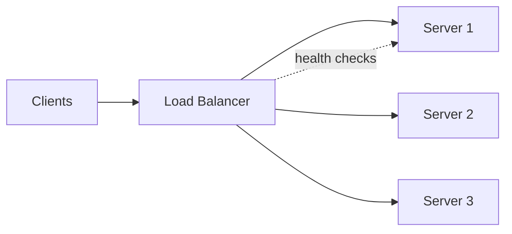

# Load Balancers

> A load balancer distributes incoming traffic across multiple servers so no single
> one is overwhelmed, and routes around failed nodes.

## Problem
One server can only handle so much, and if it dies the service goes down. To scale
horizontally you put many servers behind a single entry point that spreads the load
and hides failures.

## Core concepts

**Layer 4 (transport) vs Layer 7 (application)**
- **L4** balances by IP/port — fast, protocol-agnostic, no visibility into content.
- **L7** balances by HTTP content — can route by URL path, header, or cookie;
  terminate TLS; do sticky sessions. More features, slightly more overhead.

**Balancing algorithms**
- **Round robin** — rotate through servers in order.
- **Weighted round robin** — bigger servers get more traffic.
- **Least connections** — send to the server with fewest active connections.
- **Least response time** — fastest server wins.
- **IP hash** — same client always lands on the same server (sticky).

**Health checks** — the LB probes each server; unhealthy ones are removed from
rotation and re-added when they recover.

**Don't make the LB a SPOF** — run load balancers in a redundant pair (active-passive
or active-active), often fronted by DNS or a floating/virtual IP.

## Example — round-robin + health check
Three app instances sit behind one LB. Requests rotate `web1 → web2 → web3 → web1…`
(round-robin). You stop `web2`; the LB's health check fails for it within a couple of
probes, so it's **ejected** and traffic flows only to `web1`/`web3` — **no client sees an
error**. When `web2` recovers, it's added back. Built in the
[scalable web service project](../../3-practice/project-scalable-web-service.md).

## Common tools
| Tool | Layer | Use it for |
| --- | --- | --- |
| **Nginx**, **HAProxy** | L7/L4 | software LB / reverse proxy on your own boxes |
| **Envoy** | L7 | modern proxy; the data plane in service meshes |
| **AWS ALB** | L7 | HTTP routing, TLS, WebSocket, target groups |
| **AWS NLB** | L4 | raw TCP/UDP, ultra-low latency, static IPs |
| **GCP/Azure LB**, **F5** | L4/L7 | cloud / hardware load balancing |

## Trade-offs
- **Sticky sessions** simplify stateful apps but hurt even distribution and break when
  a node dies → prefer stateless servers + shared session store.
- **L7** gives smart routing at the cost of more CPU (TLS, parsing).
- Hardware LBs are fast but pricey; software LBs (Nginx, HAProxy, Envoy) and cloud LBs
  (ELB/ALB) are the common default.

## Real-world examples
- **AWS ALB** (L7) routes by path/host to different microservices; **NLB** (L4) handles
  millions of low-latency connections.
- **Envoy** is the data-plane LB inside service meshes (Istio).

## References
- [HAProxy](https://www.haproxy.org/) / [Envoy](https://www.envoyproxy.io/)
- *Designing Data-Intensive Applications*
