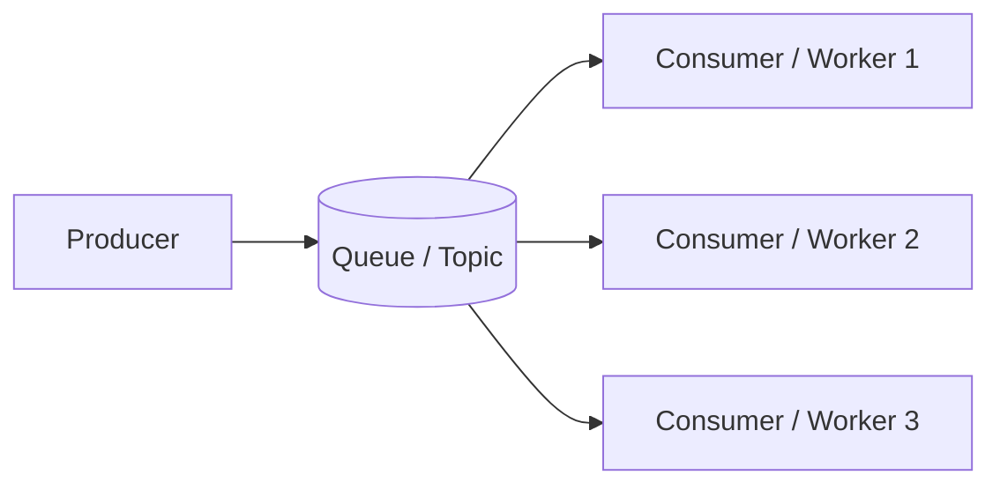

# Message Queues & Pub/Sub

> A message queue lets services communicate **asynchronously**: a producer drops a
> message, a consumer picks it up later. It decouples senders from receivers.

## Problem
If service A calls service B synchronously, A is blocked while B works, and if B is
down or slow, A fails too. For work that doesn't need an immediate answer (send email,
process video, update analytics), you want to hand it off and move on.

## Core concepts

**Queue (point-to-point)** — each message is consumed by exactly **one** consumer.
Used to distribute work across a pool of workers.

**Pub/Sub (publish-subscribe)** — each message is broadcast to **all** subscribers.
Used for events that many services care about.

**Why it helps**
- **Decoupling** — producer and consumer don't need to be up at the same time.
- **Buffering / load leveling** — absorb spikes; workers drain at their own pace.
- **Scalability** — add more workers to process faster.
- **Resilience** — if a worker dies, the message stays in the queue and is retried.

**Delivery guarantees**
- **At-most-once** — may lose messages, never duplicates.
- **At-least-once** — never lose, but may duplicate → consumers must be **idempotent**.
- **Exactly-once** — hardest; usually approximated with dedup + idempotency.

**Key concepts** — acknowledgements (ack/nack), visibility timeout, **dead-letter
queue** (DLQ) for messages that keep failing, ordering (often per-partition), and
backpressure.

## Trade-offs
- Async adds **eventual consistency** and **complexity** (retries, ordering, dedup,
  monitoring) — don't use a queue where a simple sync call suffices.
- **Log-based** systems (Kafka) keep messages after consumption (replayable, multiple
  consumers) vs **traditional brokers** (RabbitMQ/SQS) that delete on ack.

## Real-world examples
- **Kafka** — high-throughput event streaming, log of events, replayable.
- **RabbitMQ** — flexible routing, classic task queues.
- **AWS SQS/SNS** — managed queue + pub/sub.

## References
- [Kafka docs](https://kafka.apache.org/documentation/)
- *Designing Data-Intensive Applications* — Ch. 11 (Stream Processing)
