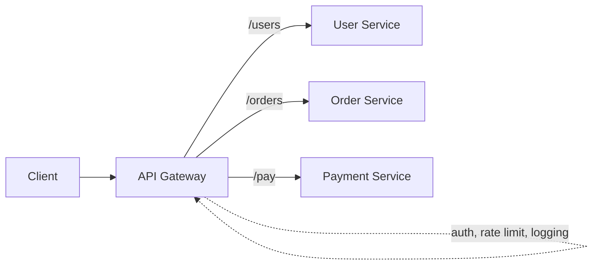

# Reverse Proxies & API Gateways

> A **reverse proxy** sits in front of servers and forwards client requests to them.
> An **API gateway** is a specialized reverse proxy for APIs that adds auth, routing,
> rate limiting, and more.

## Problem
You don't want clients talking directly to your internal servers. You need a single
front door that can hide topology, terminate TLS, enforce policy, and route requests —
without baking all that into every service.

## Core concepts

**Forward vs reverse proxy**
- **Forward proxy** acts on behalf of the *client* (e.g. corporate web filter, VPN).
- **Reverse proxy** acts on behalf of the *server* (clients don't know the real
  backend). Examples: Nginx, HAProxy, Envoy.

**What a reverse proxy does**
- TLS termination, compression, caching of static content.
- Load balancing, hiding internal IPs, absorbing some attacks.

**API gateway = reverse proxy + API concerns**

Cross-cutting features it centralizes:
- **Authentication / authorization** (validate tokens once).
- **Rate limiting & throttling**.
- **Request routing & aggregation** (fan out to several services, combine results).
- **Protocol translation** (e.g. REST ↔ gRPC), logging, metrics.

## Example — one front door, many services
A single gateway endpoint routes by path: `/users/*` → User service, `/orders/*` → Order
service, `/pay/*` → Payment service. The gateway validates the auth token **once**, applies
a rate limit, logs the request, terminates TLS — then forwards to the right backend. Each
service no longer re-implements auth/rate-limiting. Built in the
[event-driven orders project](../../3-practice/project-event-driven-orders.md) (API tier).

## Common tools
| Tool | Use it for |
| --- | --- |
| **Kong**, **Apigee**, **Tyk** | full-featured API gateways (auth, quotas, plugins) |
| **AWS API Gateway** | managed/serverless gateway (authorizers, usage plans, Lambda) |
| **Nginx**, **Traefik**, **HAProxy** | reverse proxy + lightweight gateway |
| **Envoy** | gateway + service-mesh data plane |
| **Netflix Zuul** | the pattern's origin (JVM) |

## Trade-offs
- A gateway removes duplicated logic from services — but becomes a **critical
  dependency and potential bottleneck/SPOF**; make it redundant.
- Too much logic in the gateway recreates a "smart pipe" anti-pattern; keep business
  logic in services.
- **BFF (Backend for Frontend)** is a gateway variant: one tailored gateway per client
  type (web, mobile) to avoid one-size-fits-all APIs.

## Real-world examples
- **Kong, AWS API Gateway, Apigee, NGINX** are common gateways.
- **Netflix Zuul** pioneered the gateway pattern for routing to hundreds of services.

## References
- [Kong](https://konghq.com/) / [AWS API Gateway](https://aws.amazon.com/api-gateway/)
- Microservices.io — [API Gateway pattern](https://microservices.io/patterns/apigateway.html)
