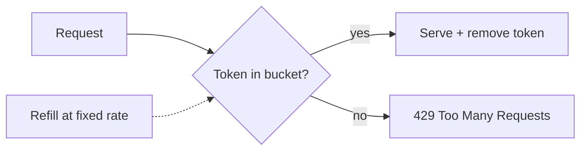

# Rate Limiting

> Rate limiting caps how many requests a client can make in a time window, protecting
> a system from overload, abuse, and runaway costs.

## Problem
Without limits, a buggy client, a scraper, or an attacker can flood your service,
degrade it for everyone, and run up your bill. Rate limiting enforces fair use and
keeps the system stable under pressure.

## Core concepts

**Common algorithms**
- **Token bucket** — a bucket fills with tokens at a fixed rate; each request consumes
  one. Allows short bursts up to bucket size. *Most popular.*
- **Leaky bucket** — requests queue and drain at a constant rate; smooths bursts into
  a steady flow.
- **Fixed window** — count requests per fixed interval (e.g. per minute). Simple, but
  allows 2× burst at the window boundary.
- **Sliding window log / counter** — track timestamps or weighted counts over a rolling
  window; smoother and more accurate than fixed window.

**Where to enforce** — at the API gateway / load balancer (before it reaches your
services), and sometimes per-service. Counters are usually kept in a **shared store
like Redis** so the limit holds across many server instances.

**What to key on** — API key, user ID, IP address, or a combination. Different tiers
get different limits.

**Telling the client** — respond with `429 Too Many Requests` plus headers like
`Retry-After` and `X-RateLimit-Remaining`.

## Example — 5 requests/sec, shared counter
A client is limited to 5 req/s. The gateway runs an atomic `INCR` on a Redis key `rl:<ip>`
with a 1-second TTL: requests 1–5 return `200`, request 6 returns `429 Too Many Requests`
with `Retry-After: 1`. Because the counter is in Redis, the limit holds **across all gateway
instances** — not 5-per-instance. Built in the
[notification service project](../../3-practice/project-notification-service.md) and
detailed in the [rate limiter case study](../../2-case-studies/rate-limiter.md).

## Common tools
| Tool | Use it for |
| --- | --- |
| **Redis** (+ Lua script) | the shared atomic counter / token bucket |
| **Nginx `limit_req`** | edge rate limiting on your own proxy |
| **Kong / Envoy / Apigee** | gateway-level rate limiting plugins |
| **AWS API Gateway usage plans**, **AWS WAF rate rules** | managed throttling + abuse protection |
| **Cloudflare Rate Limiting** | edge/DDoS-grade limiting before traffic hits you |

## Trade-offs
- **Distributed accuracy vs latency** — a perfectly global counter needs coordination
  (slower); approximate per-node limits are faster but leak a bit.
- Too strict → block legit bursts; too loose → no protection. Tune with real traffic.
- Token/leaky bucket handle bursts gracefully; fixed window is simplest but has edge
  spikes.

## Real-world examples
- **Stripe, GitHub, Twitter APIs** publish rate limits with `X-RateLimit-*` headers.
- **Cloudflare / API gateways** offer rate limiting as a built-in edge feature.

## References
- [Stripe rate limiting](https://stripe.com/blog/rate-limiters)
- [System Design Primer — rate limiter](https://github.com/donnemartin/system-design-primer)
