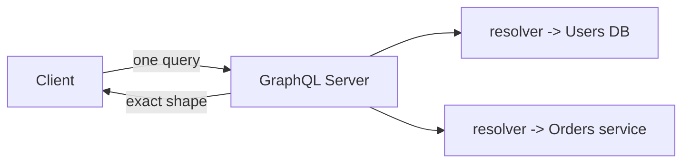

# GraphQL

> GraphQL is a query language for APIs that lets the **client** specify exactly what
> data it needs, from a single endpoint, getting back precisely that shape.

## Problem
REST endpoints return fixed payloads. Clients often **over-fetch** (get fields they
don't need) or **under-fetch** (must call several endpoints and stitch results). Mobile
apps especially want to minimize round trips and bytes.

## Core concepts

**One endpoint, client-defined queries**
```graphql
query {
  user(id: 123) {
    name
    orders(last: 3) { id total }
  }
}
```
The response mirrors the query — only `name` and the last 3 orders, in one request.

**Schema & types** — a strongly typed **schema** defines available data. Three
operation types:
- **Query** — read.
- **Mutation** — write.
- **Subscription** — real-time updates (over WebSockets).

**Resolvers** — server functions that fetch each field from databases/services.



## Trade-offs
- ✅ No over/under-fetching, single round trip, strongly typed, great for diverse
  clients and rapidly evolving frontends; introspectable.
- ⚠️ **Caching is harder** (POST to one URL vs HTTP GET caching).
- ⚠️ **N+1 query problem** in resolvers → mitigate with batching (DataLoader).
- ⚠️ Complex/expensive queries need **depth/complexity limiting** to prevent abuse.
- **REST vs GraphQL** — REST for simple/cacheable public APIs; GraphQL when clients
  need flexible, aggregated data.

## Real-world examples
- **GitHub** offers a full GraphQL API alongside REST.
- **Facebook** created GraphQL for its mobile apps; **Shopify, Netflix** use it for
  flexible client data needs.

## References
- [graphql.org](https://graphql.org/)
- [Apollo GraphQL](https://www.apollographql.com/docs/)
