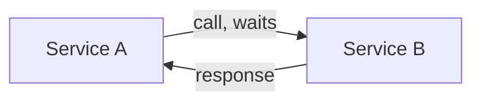
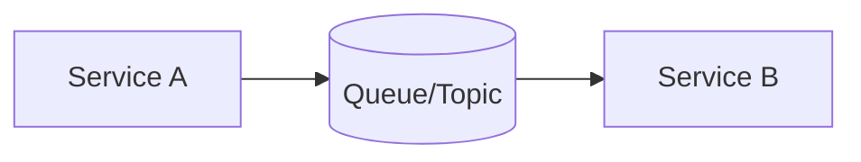

# Synchronous vs Asynchronous Communication

> **Synchronous** — the caller waits for the response. **Asynchronous** — the caller
> hands off work and continues, getting the result later (or never directly).

## Problem
How services talk shapes the whole system's coupling, latency, and resilience. Calling
everything synchronously creates fragile chains; doing everything async adds
complexity. The choice is per-interaction.

## Core concepts

**Synchronous (request/response)** — REST, gRPC. Caller blocks until it gets an answer.

- ✅ Simple, immediate result, easy to reason about and debug.
- ⚠️ **Temporal coupling** — both must be up; B's latency/failure becomes A's; chains
  multiply failure probability and latency.

**Asynchronous (messaging/events)** — queues, pub/sub. Caller emits a message and moves
on; a consumer processes it later.

- ✅ **Decoupled** (B can be down/slow), absorbs spikes, scales workers independently,
  resilient (retries, DLQ).
- ⚠️ **Eventual consistency**, harder to trace/debug, ordering & idempotency concerns,
  no immediate result to return to a user.

## Trade-offs
- Use **sync** when the caller needs the answer now (read a price, validate a login,
  fetch a profile).
- Use **async** for work that can happen later or fan out to many consumers (send
  email, generate thumbnails, update analytics, propagate events).
- Real systems mix both: a sync API call that **enqueues** async background work and
  returns immediately (e.g. "your upload is processing").

## Real-world examples
- **Checkout**: sync call to charge the card (need the result) + async events to send
  the receipt, update inventory, and notify shipping.
- **Uber/DoorDash**: request a ride synchronously, but dispatch, pricing, and
  notifications flow through async event streams.

## References
- *Designing Data-Intensive Applications* — Ch. 11
- [Microservices.io — communication patterns](https://microservices.io/patterns/communication-style/messaging.html)
