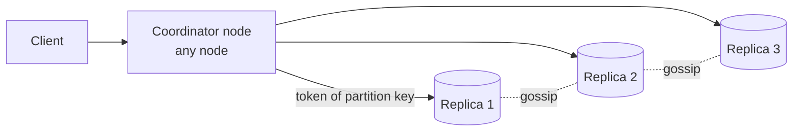
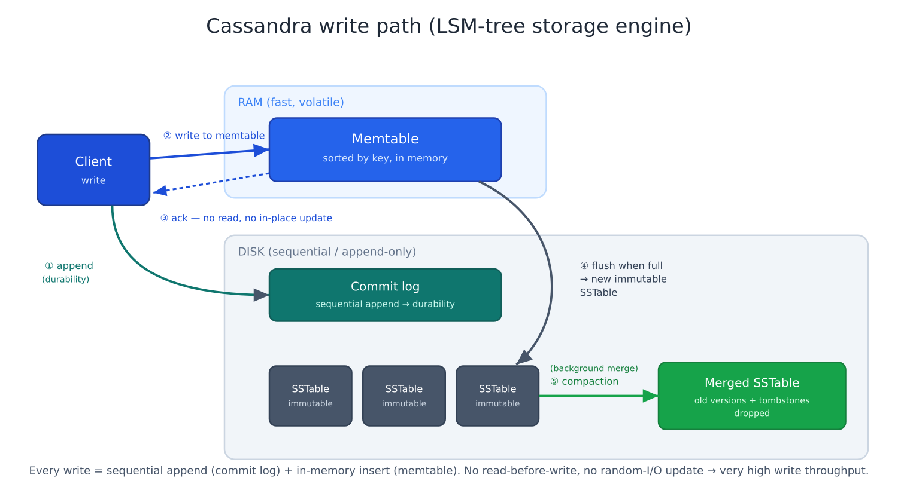

# Apache Cassandra (a NoSQL deep-dive)

> A masterless, wide-column NoSQL database built for **huge write volume** and
> **linear scale-out** across many nodes and data centers, trading joins and strong
> consistency for availability and throughput.

> Deep-dive companion to [SQL vs NoSQL](./sql-vs-nosql.md) — read that first for *when*
> to reach for a wide-column store; this page is *how Cassandra actually works*.

## Problem
Some workloads are **write-dominated and never stop growing**: chat messages, metrics,
event logs, feeds, IoT telemetry. A single SQL primary becomes the bottleneck — writes
fight over the same B-tree pages and disk, and there's one machine to outgrow. You want
writes to stay fast as data grows to trillions of rows, and to add capacity by just
**adding nodes**. That's exactly what Cassandra optimizes for.

## Core concepts

**Masterless ring.** There is no leader. Every node is equal (peer-to-peer), so there's
no single bottleneck and no failover election. Data is spread around a ring by
[consistent hashing](../building-blocks/consistent-hashing.md) with virtual nodes for
balance: `partition key → hash (token) → owning node`. Any node can receive your request
and act as the **coordinator**, forwarding to the replicas. Nodes learn each other's
state through a **gossip** protocol.



**Replication & tunable consistency.** Each partition is copied to **RF** nodes (the next
RF distinct nodes clockwise, ideally spread across racks/data centers). You then choose a
**consistency level (CL)** *per query*: `ONE`, `LOCAL_QUORUM`, `QUORUM`, `ALL`. If
`R + W > RF` (e.g. QUORUM read + QUORUM write at RF=3) you get strong consistency; `ONE`
is fastest but eventual. This is [CAP](../fundamentals/cap-theorem.md) made into a dial.

**Query-first data model.** You don't model entities then query them — you model **around
the queries**. Pick the partition key so your main read hits a *single partition*, and
the clustering keys so rows come back already sorted. No joins; you **denormalize and
duplicate** data into one table per query pattern (see CQRS in
[sql-vs-nosql](./sql-vs-nosql.md#common-real-world-patterns)).

## The write path — why Cassandra is write-optimized
A write **does not read first** and **never updates in place**:



1. **Append to the commit log** — a sequential disk write, for durability/crash recovery.
2. **Insert into the memtable** — an in-memory, sorted structure.
3. **Ack the client.** Done. No disk seek, no read-modify-write, no lock.
4. When the memtable fills, **flush it to an SSTable** — an immutable, sorted file on disk.
5. **Compaction** runs in the background, merging SSTables and dropping superseded
   versions and tombstones.

This is a **log-structured merge tree (LSM)**. Contrast a relational B-tree, which must
*locate* the row and update it in place — random I/O, frequently read-before-write.
Cassandra turns every write into an append, so write throughput is very high and grows
~linearly as you add nodes.

The flip side is the **read path**: a row may live in the memtable *plus* several
SSTables, so a read merges them. Cassandra keeps reads fast with a **bloom filter** per
SSTable (skip files that can't contain the key), a partition index, and key caching —
and compaction keeps the number of SSTables down.

## Handling heavy writes — the common techniques
1. **Partition-key design (the #1 lever).** Spread writes across many partitions; never
   funnel them to one. A *hot partition* means one node does all the work while the rest
   idle. Use a high-cardinality key (`user_id`, `device_id`, `channel_id`).
2. **Bucket unbounded partitions.** Time-series/feeds/chat grow forever — add a time
   bucket to the partition key (`channel_id + month`) so no partition gets huge. Aim to
   keep partitions under ~100 MB / ~100k rows. (This is the Discord trick.)
3. **Choose the compaction strategy for the workload:**
   - **STCS** (size-tiered) — default, good for write-heavy.
   - **TWCS** (time-window) — time-series + TTL; drops whole expired SSTables cheaply.
   - **LCS** (leveled) — read-heavy; fewer SSTables per read, but more write amplification.
4. **Token-aware driver routing.** The client hashes the partition key and sends the
   write straight to a replica, skipping the extra coordinator hop. Most drivers do this
   automatically — a big throughput win.
5. **Tune write consistency.** `ONE` / `LOCAL_QUORUM` for throughput; reserve `ALL` for
   when you truly need it.
6. **Use TTLs** to auto-expire data instead of mass deletes (metrics, sessions).
7. **Avoid the write-killing anti-patterns:**
   - **Logged batches across many partitions** — often misused as a performance tool;
     they're the opposite. Use batches only for atomicity, single-partition.
   - **Tombstone buildup** from deletes / writing `null`s / collection churn — they pile
     up and later poison reads.
   - **Read-before-write & lightweight transactions (LWT / Paxos)** — these discard the
     append-only advantage; use sparingly.
8. **Scale out, not up.** Out of write capacity? Add nodes — throughput grows ~linearly
   because there's no shared master.

## Example — modeling chat messages around the query
The query is *"recent messages in a channel."* Model the table so it's one
single-partition, pre-sorted range read:

```sql
CREATE TABLE messages (
    channel_id  bigint,
    bucket      text,        -- e.g. '2026-06'  → keeps partitions bounded
    message_id  timeuuid,    -- time-ordered
    author_id   bigint,
    body        text,
    PRIMARY KEY ((channel_id, bucket), message_id)
) WITH CLUSTERING ORDER BY (message_id DESC);

-- "give me the latest 50" = one partition, already sorted, one node:
SELECT * FROM messages
WHERE channel_id = 42 AND bucket = '2026-06'
ORDER BY message_id DESC
LIMIT 50;
```

`(channel_id, bucket)` is the **partition key** (placement + bounded size); `message_id`
is the **clustering key** (sort order within the partition). This is the same workload as
the Discord story in [sql-vs-nosql](./sql-vs-nosql.md#a-real-problem--discords-chat-messages).

## Common tools
| Tool | Relationship |
| --- | --- |
| **Apache Cassandra** | the reference wide-column store |
| **ScyllaDB** | drop-in C++ reimplementation — same data model/CQL, lower tail latency, fewer nodes |
| **DataStax Enterprise / Astra** | managed/commercial Cassandra |
| **Amazon Keyspaces** | Cassandra-compatible managed service |
| **HBase / Bigtable** | sibling wide-column stores (different lineage) |
| **CQL** | Cassandra Query Language — SQL-like surface, but no joins/arbitrary WHERE |

## Trade-offs
- ✅ Very high, linearly-scalable **write throughput**; no single master; multi-DC
  replication and tunable consistency; no downtime to add nodes.
- ⚠️ **Query-first modeling** — you must know your access patterns up front; no joins,
  limited ad-hoc queries, lots of denormalization/duplication.
- ⚠️ **Eventual consistency** by default; needs repair/anti-entropy; **tombstones** and
  unbounded partitions are real operational footguns.
- **Use it for:** write-heavy, scale-out, known-query workloads (time-series, feeds,
  messaging, metrics). **Avoid for:** transactional/relational workloads with ad-hoc
  queries and joins — that's still [SQL](./sql-vs-nosql.md).

## Real-world examples
- **Discord** — trillions of chat messages (later moved to ScyllaDB; same data model).
- **Netflix** — viewing history and many high-write services across multiple regions.
- **Apple, Instagram, Uber** — among the largest Cassandra deployments for write-heavy data.

## References
- [Apache Cassandra documentation](https://cassandra.apache.org/doc/latest/)
- [Discord — How Discord stores trillions of messages](https://discord.com/blog/how-discord-stores-trillions-of-messages)
- *Designing Data-Intensive Applications* — Ch. 3 (LSM-trees & SSTables)
- [Amazon Dynamo paper](https://www.allthingsdistributed.com/files/amazon-dynamo-sosp2007.pdf) (the consistency/replication lineage)
