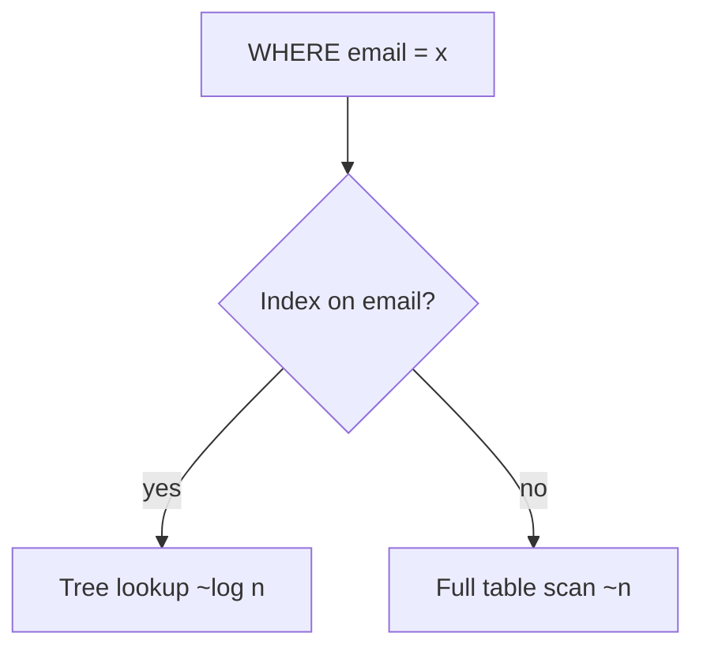

# Indexing & Query Performance

> An index is an auxiliary data structure that lets the database find rows by a column
> value without scanning the whole table — trading extra storage and slower writes for
> much faster reads.

## Problem
Finding rows by scanning every record (a **full table scan**) is O(n) and gets slower
as data grows. Indexes turn that into roughly O(log n) lookups, which is the
difference between a query taking milliseconds and seconds.

## Core concepts

**B-Tree index** — the default for most relational DBs. A balanced tree kept in sorted
order; supports equality **and** range queries (`>`, `<`, `BETWEEN`, `ORDER BY`).

**Hash index** — maps a hashed key to a location. O(1) equality lookups, but **no**
range queries. Used by in-memory stores.

**LSM-tree** — write-optimized (buffers writes in memory, flushes sorted files to
disk). Powers write-heavy stores like Cassandra, RocksDB, LevelDB.

**Important distinctions**
- **Clustered index** — the table *is* stored in index order (one per table; usually
  the primary key). Range scans on it are very fast.
- **Non-clustered (secondary) index** — a separate structure pointing back to rows.
- **Composite index** — on multiple columns `(a, b)`; order matters (leftmost-prefix
  rule — it helps queries filtering on `a`, or `a` and `b`, but not `b` alone).
- **Covering index** — includes all columns a query needs, so the DB never touches the
  table.

## Trade-offs
- **Reads faster, writes slower** — every insert/update/delete must also update each
  index. Don't over-index write-heavy tables.
- Indexes consume **storage** and memory.
- **Low-cardinality** columns (e.g. boolean) index poorly.
- Use `EXPLAIN`/`EXPLAIN ANALYZE` to verify the planner actually uses your index.

## Real-world examples
- Adding an index on a frequently filtered `user_id` column can drop a query from
  seconds to milliseconds.
- **Cassandra/RocksDB** use LSM-trees to sustain very high write throughput.

## References
- *Designing Data-Intensive Applications* — Ch. 3 (Storage and Retrieval)
- [Use The Index, Luke](https://use-the-index-luke.com/)
