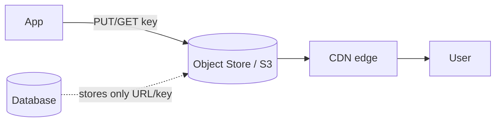

# Object & Blob Storage

> Object storage holds large unstructured files (images, video, backups) as
> "objects" in a flat namespace, accessed by a key over HTTP — built for massive scale
> and durability rather than low-latency random access.

## Problem
Databases are the wrong place for big binary files (photos, videos, logs). They bloat
the DB, are expensive per GB, and don't need transactional access. You need cheap,
durable, virtually unlimited storage for blobs.

## Core concepts

**Object vs file vs block storage**
- **Block storage** — raw disks/volumes (EBS); low latency, attached to one machine.
  Good for databases.
- **File storage** — a hierarchical filesystem (NFS); shared, POSIX semantics.
- **Object storage** — flat key → object + metadata, accessed via HTTP API (S3).
  Massive scale, high durability, cheap; not for low-latency random writes.

**Key pattern** — store the *file* in object storage and keep only its **URL/key** in
your database. Serve it to users through a **CDN**.

**Features** — versioning, lifecycle policies (auto-move to cold/archive tiers),
server-side encryption, **presigned URLs** (time-limited direct upload/download
without proxying through your servers), and event notifications.

## Trade-offs
- Cheap, durable (S3 advertises **11 nines** of durability), effectively unlimited —
  but **higher latency**, eventually-consistent listings historically, and **no
  in-place edits** (objects are replaced whole).
- Not a database — you can't query object *contents* efficiently (though tools like S3
  Select / Athena help).

## Real-world examples
- **AWS S3, Google Cloud Storage, Azure Blob** are the standard.
- Nearly every app stores user uploads (avatars, documents, video) in S3-style storage
  and serves them via CloudFront/Cloudflare.

## References
- [AWS S3](https://aws.amazon.com/s3/)
- [MinIO](https://min.io/) — self-hosted S3-compatible store
