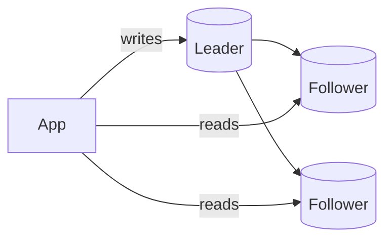

# Database Replication

> Replication keeps copies of the same data on multiple nodes — for availability,
> read scaling, and durability.

## Problem
A single database is a single point of failure and a single point of capacity. If it
dies you lose the service (and maybe data); if reads exceed its capacity you're stuck.
Replication makes copies so you can survive failures and serve more reads.

## Core concepts

**Leader–follower (primary–replica)**
- All **writes** go to the leader; the leader streams changes to followers.
- **Reads** can be served by followers → scales read-heavy workloads.
- On leader failure, a follower is promoted (**failover**).

**Synchronous vs asynchronous**
- **Sync** — leader waits for follower(s) to confirm before acking the write. No data
  loss on failover, but slower and stalls if a follower lags.
- **Async** — leader acks immediately, replicates in the background. Fast, but a
  crash can lose the last writes (**replication lag**).
- **Semi-sync** — wait for at least one follower; common compromise.

**Multi-leader** — multiple nodes accept writes (e.g. one per region). Better write
availability/locality, but introduces **write conflicts** that need resolution.

**Leaderless (Dynamo-style)** — any replica accepts reads/writes; uses **quorums**
(W + R > N) to stay consistent. Used by Cassandra, DynamoDB.

## Trade-offs
- **Replication lag** breaks read-your-own-writes (you write to leader, read a stale
  follower). Fixes: read from leader for recent writes, or track versions.
- Sync = safe but slow; async = fast but can lose data.
- Multi-leader/leaderless = high availability but conflict handling (last-write-wins,
  vector clocks, CRDTs).

## Real-world examples
- **PostgreSQL/MySQL** streaming replication with read replicas behind the app.
- **Cassandra** quorum reads/writes across replicas in multiple datacenters.

## References
- *Designing Data-Intensive Applications* — Ch. 5 (Replication)
- [PostgreSQL replication docs](https://www.postgresql.org/docs/current/high-availability.html)
