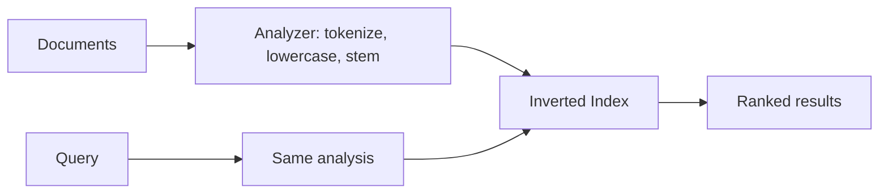

# Search Engines (Inverted Index)

> A search engine builds an **inverted index** — a map from each word to the list of
> documents containing it — so full-text queries are fast and relevance-ranked.

## Problem
`SELECT ... WHERE body LIKE '%term%'` can't use a normal index, scans every row, and
doesn't rank results or handle typos, synonyms, or relevance. Searching large text
corpora needs a purpose-built structure.

## Core concepts

**Inverted index** — instead of "document → words", store "word → documents":
```
"design"  -> [doc1, doc7, doc42]
"system"  -> [doc7, doc9, doc42]
```
A query for `system design` intersects the posting lists → docs 7 and 42.



**Text analysis pipeline** — tokenization, lowercasing, **stemming/lemmatization**
("running" → "run"), stop-word removal, synonyms. The *same* pipeline is applied to
documents and queries.

**Relevance ranking** — **TF-IDF** and **BM25** score how important a term is to a
document vs the whole corpus, so the best matches rank first.

**Beyond keywords** — modern search adds **vector / semantic search** (embeddings +
approximate nearest neighbor) to match meaning, not just words, and combines both
("hybrid search").

## Example — why an inverted index beats LIKE
`SELECT * FROM articles WHERE body LIKE '%system design%'` scans every row, can't rank, and
misses "designing systems." A search engine instead builds an **inverted index**:
```
"design" -> [doc1, doc7, doc42]
"system" -> [doc7, doc9, doc42]
```
A query for `system design` **intersects** the posting lists → docs 7 and 42, ranked by
relevance (BM25), with stemming/synonyms applied. You keep the DB as source of truth and
sync changes into the index (see the [CDC→search project](../../3-practice/project-cdc-search.md)).

## Common tools
| Tool | Use it for |
| --- | --- |
| **Elasticsearch / OpenSearch** | full-text search, logging (ELK), analytics |
| **Apache Solr** | mature Lucene-based search |
| **Typesense / Meilisearch** | lightweight, fast, developer-friendly search |
| **Algolia** | hosted instant/typeahead search |
| **pgvector / OpenSearch k-NN** | semantic/vector search (embeddings) |

## Trade-offs
- Search engines are a **secondary store**: you index data from your primary DB, so
  there's **sync/lag** and eventual consistency to manage (via CDC, dual writes, or
  batch reindex).
- Powerful relevance/aggregations, but operationally heavy (cluster sizing, shard/
  replica tuning, reindexing on mapping changes).
- Not a system of record — don't make it your source of truth.

## Real-world examples
- **Elasticsearch / OpenSearch** and **Apache Solr** (both on **Lucene**) power site
  search, logging (ELK stack), and analytics.
- E-commerce product search, log search (Kibana), and autocomplete.

## References
- [Elasticsearch: inverted index](https://www.elastic.co/blog/found-elasticsearch-from-the-bottom-up)
- *Introduction to Information Retrieval* — Manning et al.
