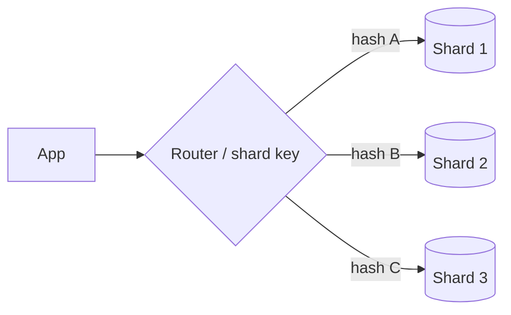

# Sharding & Partitioning

> Sharding splits one large dataset across multiple databases (shards), so each holds
> only a slice — enabling horizontal scale of both storage and writes.

## Problem
Replication scales reads, but every node still holds the **whole dataset** and all
**writes** go to one leader. When data or write volume outgrows a single machine, you
must split the data itself. That's sharding (a.k.a. horizontal partitioning).

## Core concepts

**Partitioning strategies**
- **Range-based** — split by key ranges (A–M on shard 1, N–Z on shard 2). Good for
  range scans; risks **hot spots** if data is skewed.
- **Hash-based** — `shard = hash(key) % N`. Even distribution; bad at range queries.
  Use **consistent hashing** so resharding doesn't move everything.
- **Directory/lookup-based** — a lookup service maps keys → shards. Flexible
  rebalancing; the directory is an extra hop and a SPOF to protect.

**Choosing a shard key** — the single most important decision. A good key:
- Spreads load evenly (high cardinality, no hot keys).
- Keeps related data that's queried together on the same shard.
- A poor key (e.g. `country` when 80% are in one country) creates hot shards.

## Trade-offs
- **Cross-shard queries and joins** become hard/expensive (scatter-gather).
- **Cross-shard transactions** lose simple ACID → need distributed transactions/sagas.
- **Rebalancing** when adding shards is operationally heavy — consistent hashing and
  pre-splitting help.
- **Celebrity/hot-key problem** — one popular key overloads its shard.
- Combine with **replication**: each shard is itself replicated for availability.

## Real-world examples
- **Instagram** sharded PostgreSQL by user ID early on.
- **MongoDB / Cassandra / DynamoDB** shard (partition) automatically by a partition
  key.
- **Vitess** shards MySQL behind a routing layer (used by YouTube, Slack).

## References
- *Designing Data-Intensive Applications* — Ch. 6 (Partitioning)
- [Vitess](https://vitess.io/)
