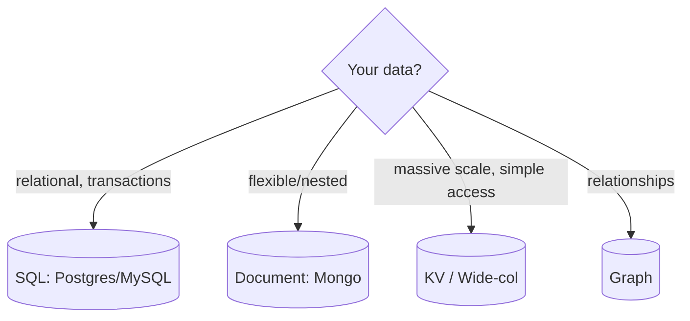

# SQL vs NoSQL

> SQL (relational) databases store structured data in tables with a fixed schema and
> strong guarantees; NoSQL databases trade some of those guarantees for flexibility
> and horizontal scale.

## Problem
The database is usually the hardest part to scale and the most expensive to get
wrong. Choosing the right *type* up front — based on your data shape, access patterns,
and consistency needs — saves painful migrations later.

## Core concepts

**SQL / relational** (PostgreSQL, MySQL)
- Structured tables, fixed schema, relationships via joins.
- **ACID** transactions (Atomic, Consistent, Isolated, Durable).
- Powerful ad-hoc queries (SQL), strong consistency.
- Scales **up** easily; scales **out** with more effort (replicas, sharding).

**NoSQL** — a family, not one thing:
| Type | Example | Shape | Good for |
| --- | --- | --- | --- |
| Key-value | Redis, DynamoDB | key → blob | caching, sessions, simple lookups |
| Document | MongoDB | JSON documents | flexible/nested data, catalogs |
| Wide-column | Cassandra, HBase | rows with dynamic columns | huge write volume, time-series |
| Graph | Neo4j | nodes + edges | relationships, social graphs |

NoSQL often favors **BASE** (Basically Available, Soft state, Eventual consistency)
and is built to scale **out** across many nodes.

## Example — picking per workload (polyglot persistence)
One e-commerce app uses several stores, each matched to its access pattern:
- **Orders & payments** → **PostgreSQL** (need ACID transactions, joins).
- **Product catalog** (varied, nested attributes) → **MongoDB** (flexible documents).
- **Shopping cart / sessions** → **Redis** or **DynamoDB** (simple key lookups, huge scale).
- **"Customers who bought…" recommendations** → a **graph DB** (relationships).

There's no single "best" database — you choose per workload. Modeled in the
[scalable web service](../../3-practice/project-scalable-web-service.md) (SQL) and
[key-value store case study](../../2-case-studies/key-value-store.md) (NoSQL).

## Common tools
| Tool | Family | Sweet spot |
| --- | --- | --- |
| **PostgreSQL**, **MySQL** | Relational | transactions, joins, the default choice |
| **MongoDB** | Document | flexible/nested data, fast iteration |
| **Cassandra / ScyllaDB** | Wide-column | massive writes, time-series, multi-DC |
| **DynamoDB** | Key-value/document | serverless scale, predictable latency |
| **Redis** | Key-value (in-mem) | cache, sessions, counters, queues |
| **Neo4j** | Graph | relationship-heavy queries |

## Trade-offs
- **SQL** — consistency, joins, mature tooling; harder horizontal scaling, rigid
  schema.
- **NoSQL** — horizontal scale, flexible schema, high write throughput; weaker
  consistency, limited joins, you model around **access patterns** (and often
  denormalize/duplicate data).
- **Default to SQL** unless you have a concrete reason (scale, data shape, write
  volume) to go NoSQL. "Polyglot persistence" — using both — is common.

## Real-world examples
- **PostgreSQL** for orders/payments (need ACID).
- **Cassandra** for time-series/metrics and feeds (write-heavy, scale-out).
- **Redis** for sessions and caching; **MongoDB** for flexible product catalogs.

## References
- *Designing Data-Intensive Applications* — Ch. 2 & 3
- [Amazon Dynamo paper](https://www.allthingsdistributed.com/files/amazon-dynamo-sosp2007.pdf)
