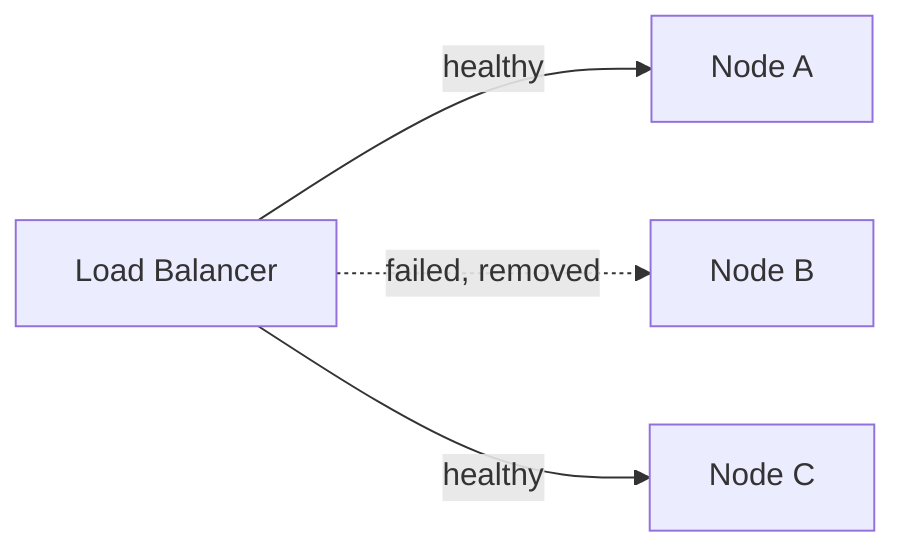

# Availability, Reliability & Fault Tolerance

> **Reliability** = the system does the right thing. **Availability** = the system is
> up and reachable. **Fault tolerance** = it keeps working when parts fail.

## Problem
Hardware fails, networks drop, software has bugs, traffic spikes. At scale, *something
is always broken*. A good design assumes failure and keeps serving users anyway.

## Core concepts

**Availability — the "nines"**
Availability is the % of time the system is up. Each extra nine is ~10× harder:

| Availability | Downtime per year |
| --- | --- |
| 99% (two nines) | ~3.65 days |
| 99.9% (three nines) | ~8.77 hours |
| 99.99% (four nines) | ~52.6 minutes |
| 99.999% (five nines) | ~5.26 minutes |

**Reliability vs availability** — a system can be *available* (responding) but
*unreliable* (returning wrong answers). You want both.

**How to achieve fault tolerance**
- **Redundancy** — no single point of failure (SPOF); run ≥2 of everything.
- **Replication** — copies of data on multiple nodes.
- **Failover** — automatically switch to a healthy replica when one dies.
- **Graceful degradation** — shed non-essential features instead of crashing
  (e.g. hide recommendations but keep checkout working).
- **Health checks + load balancers** — stop routing to sick nodes.

**MTBF & MTTR** — reliability ≈ how often it breaks (Mean Time Between Failures) and
how fast you recover (Mean Time To Recovery). Lowering MTTR (fast recovery) is often
cheaper than raising MTBF (never failing).

## Trade-offs
- More nines = more redundancy = more cost and complexity. Pick a target that matches
  the product (a bank ≠ a hobby blog).
- Redundancy across regions improves availability but adds latency and consistency
  challenges.

## Real-world examples
- **AWS S3** targets 99.99% availability and 11 nines of *durability* (data loss).
- **Netflix Chaos Monkey** randomly kills instances in production to prove the system
  tolerates failure.

## References
- *Site Reliability Engineering* (Google SRE book)
- [Netflix Chaos Engineering](https://netflix.github.io/chaosmonkey/)
