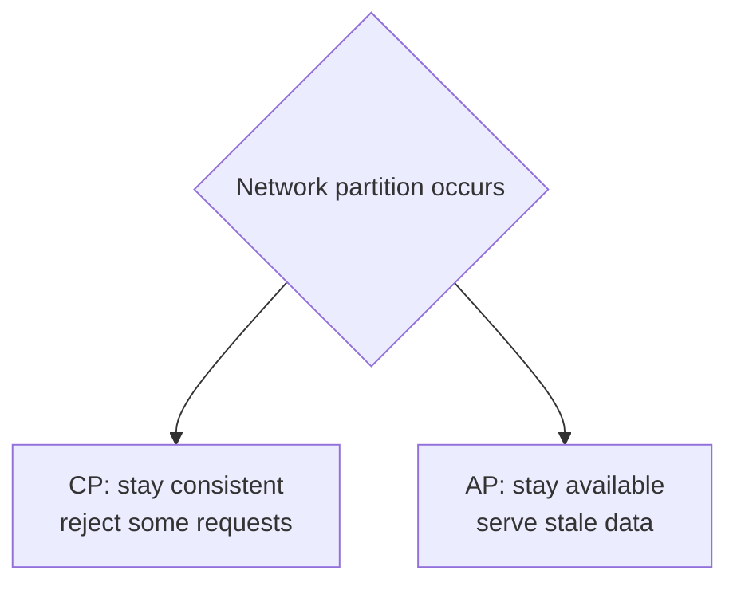

# CAP Theorem

> In a distributed system, when a network partition happens, you must choose between
> **Consistency** and **Availability** — you cannot have both.

## Problem
Once data lives on more than one machine, the network between them can fail
(a **partition**). When that happens, a node that can't reach its peers must decide:
refuse to answer (stay consistent) or answer with possibly-stale data (stay
available). CAP names this unavoidable choice.

## Core concepts

The three properties:
- **C — Consistency**: every read sees the most recent write (all nodes agree).
- **A — Availability**: every request gets a (non-error) response.
- **P — Partition tolerance**: the system keeps working despite dropped/delayed
  messages between nodes.

**The real statement:** in a distributed system partitions *will* happen, so **P is
mandatory**. The actual choice is **C vs A during a partition**.

**CP systems** — prefer correctness; become unavailable on a partition.
- Examples: traditional RDBMS clusters, HBase, ZooKeeper, etcd.
- Use when wrong data is unacceptable (banking, inventory, locks).

**AP systems** — prefer uptime; allow temporary inconsistency, reconcile later.
- Examples: Cassandra, DynamoDB, Riak.
- Use when availability matters more than perfect freshness (shopping carts, feeds,
  metrics).

**When there's no partition** you get both C and A — CAP only forces a choice
*during* a partition.

## Example — a partition forces the choice
Two replicas, A and B, normally in sync. The network link between them drops (a partition).
A client writes `x=5` to A. Another client reads `x` from B:
- A **CP** store (e.g. etcd) makes B **refuse** the read (or error) — it won't risk
  returning stale data. Consistent, but unavailable during the partition.
- An **AP** store (e.g. Cassandra) lets B return the **old** `x` — available, but stale
  until the partition heals and the replicas reconcile.
Same scenario, opposite choice. You pick per workload: a bank balance wants CP; a "likes"
counter is fine AP.

## Common tools
| Stance | Systems | Typical use |
| --- | --- | --- |
| **CP** (consistency over availability) | **etcd**, **ZooKeeper**, **Consul**, **HBase**, **Spanner** | config, leader election, locks, ledgers |
| **AP** (availability over consistency) | **Cassandra**, **DynamoDB**, **Riak**, **CouchDB** | carts, feeds, metrics, high-write data |
| **Tunable** | **DynamoDB**, **Cassandra** (per-request quorums) | choose C vs A per operation |

## Trade-offs
- CAP is a **simplification**. In practice it's a spectrum, not a binary — see
  **PACELC**: *if Partition, choose A or C; Else (normal operation), choose Latency
  or Consistency.* Even without partitions you trade latency for consistency.
- "Choosing AP" doesn't mean giving up consistency forever — it usually means
  **eventual consistency** (see [consistency models](./consistency-models.md)).

## Real-world examples
- **DynamoDB / Cassandra** (AP) power shopping carts and feeds where staying up beats
  momentary staleness.
- **etcd / ZooKeeper** (CP) store cluster config and leader-election state where a
  split-brain wrong answer would be catastrophic.

## References
- Eric Brewer, *CAP Twelve Years Later*
- [PACELC theorem](https://en.wikipedia.org/wiki/PACELC_theorem)
