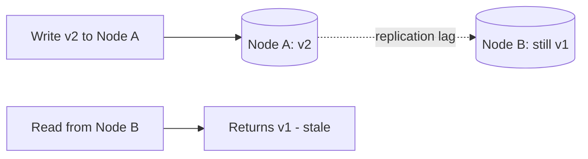

# Consistency Models

> A consistency model is the contract about *what value a read will return* after
> writes, when data is replicated across nodes.

## Problem
With replicated data, a write to one node takes time to reach the others. If you read
from a different node in between, what do you see? Consistency models define the
guarantees — from "always the latest" (strong) to "eventually agrees" (eventual).

## Core concepts

**Strong consistency** — every read returns the most recent write. The system behaves
as if there's a single copy of the data.
- ✅ Simple to reason about — no stale reads.
- ⚠️ Needs coordination between nodes → higher latency, lower availability on a
  partition (the CP side of CAP).

**Eventual consistency** — if writes stop, all replicas *eventually* converge to the
same value. Reads may be stale in the meantime.
- ✅ Fast, highly available.
- ⚠️ Apps must tolerate stale/conflicting reads.

**In-between (the useful middle ground)**
- **Read-your-own-writes** — you always see your *own* latest write (others may lag).
- **Monotonic reads** — you never see time go backwards (no older value after a
  newer one).
- **Causal consistency** — operations that are causally related are seen in order by
  everyone (a reply never appears before the message it answers).

## Trade-offs
- **Stronger consistency → more coordination → more latency and less availability.**
- **Weaker consistency → faster and more available → more complexity in the app** to
  handle staleness/conflicts.
- Choose per use case, even within one product: payments want strong; "likes" count
  is fine eventual.

## Real-world examples
- **Bank balance / inventory** → strong consistency.
- **Social media like counts, view counts** → eventual consistency (a slightly stale
  number is fine).
- **DynamoDB** lets you choose *per read*: eventually consistent (cheaper, faster) or
  strongly consistent (costlier).

## References
- *Designing Data-Intensive Applications* — Ch. 5 & 9
- [Jepsen: consistency models](https://jepsen.io/consistency)
