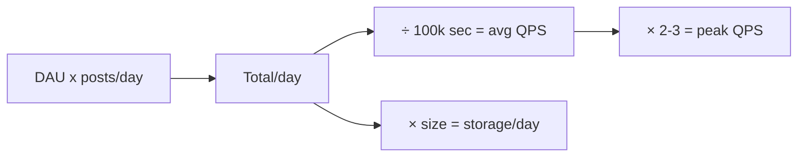

# Back-of-the-Envelope Estimation

> Quick approximate math to size a system — QPS, storage, bandwidth, memory — so your
> design matches the real scale.

## Problem
Before choosing a database or number of servers, you need a rough sense of the load:
*Is this 100 requests/sec or 1,000,000?* Estimation turns vague requirements into
numbers that justify design choices.

## Core concepts

**Numbers worth memorizing**
| Quantity | Approx |
| --- | --- |
| Seconds in a day | ~86,400 (≈10⁵) |
| 1 day ≈ | 100K seconds (rounding for math) |
| Read from memory | ~100 ns |
| Read from SSD | ~100 µs |
| Round trip within a datacenter | ~0.5 ms |
| Round trip across regions | ~100+ ms |

**Powers of two (data sizes)**
| Power | Approx | Name |
| --- | --- | --- |
| 2¹⁰ | 1 Thousand | KB |
| 2²⁰ | 1 Million | MB |
| 2³⁰ | 1 Billion | GB |
| 2⁴⁰ | 1 Trillion | TB |

**A worked example — design Twitter-ish writes**
- 300M daily active users, each posts 2 tweets/day → 600M tweets/day.
- QPS = 600M / 100K sec ≈ **6,000 writes/sec** (average).
- Peak ≈ 2–3× average → **~15,000 writes/sec**.
- Each tweet ~300 bytes → 600M × 300B ≈ **180 GB/day** ≈ 65 TB/year.

**The standard checklist**
1. **QPS** — reads and writes separately (reads usually ≫ writes).
2. **Storage** — per item × items × retention.
3. **Bandwidth** — QPS × payload size.
4. **Memory** — what fits in cache (e.g. 20% of daily reads → cache size).

## Common tools & reference numbers
| Resource | What it gives you |
| --- | --- |
| **[Latency Numbers Every Programmer Should Know](https://gist.github.com/jboner/2841832)** | memory ~100 ns, SSD ~100 µs, same-DC RTT ~0.5 ms, cross-region ~100 ms |
| **Powers of two** | 2¹⁰≈1K, 2²⁰≈1M, 2³⁰≈1B, 2⁴⁰≈1T → KB/MB/GB/TB sizing |
| **"1 day ≈ 100K seconds"** | QPS = events-per-day ÷ 100,000 (then ×2–3 for peak) |
| Pen + paper / a spreadsheet | the only "tool" you actually need — aim for orders of magnitude |

> In interviews and design docs, **state your assumptions** (DAU, ratio, payload size) so
> the numbers are checkable.

## Trade-offs
- Goal is the **right order of magnitude**, not precision. 6K vs 6.3K QPS doesn't
  change the design; 6K vs 600K does.
- Always separate **read QPS from write QPS** — read-heavy systems lean on caches and
  replicas; write-heavy systems lean on sharding and queues.

## Real-world examples
- Estimating that reads are 100× writes justifies adding read replicas + a cache.
- Estimating 65 TB/year justifies sharding instead of a single database.

## References
- [System Design Primer — appendix of numbers](https://github.com/donnemartin/system-design-primer#appendix)
- Jeff Dean, *Numbers Everyone Should Know*
