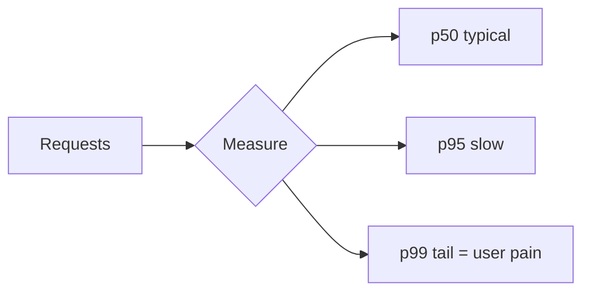

# Latency, Throughput & Response Time

> **Latency** is how long one operation takes. **Throughput** is how many operations
> you complete per unit of time. They are related but not the same.

## Problem
"Make it fast" is ambiguous. Fast for one user (latency) and fast for many users
(throughput) are different goals, and optimizing one can hurt the other. You need to
measure the right thing.

## Core concepts

**Latency** — time from request to response, usually in milliseconds.
- Often broken into network latency + processing time + queuing time.

**Throughput** — units of work per second (requests/sec, QPS, messages/sec).

**The analogy** — a highway:
- *Latency* = how long it takes one car to drive the road.
- *Throughput* = how many cars pass per minute.
- Adding lanes (parallelism) raises throughput without lowering a single car's
  travel time.

**Why averages lie — use percentiles**
Tail latency matters more than the mean. Report **p50, p95, p99**:
- p99 = 200ms means 99% of requests are faster than 200ms, 1% are slower.
- At scale, the slow 1% hits a lot of users — and a single page that makes 100
  backend calls will *usually* touch a p99 path.

**Little's Law** — `concurrency = throughput × latency`. If each request takes 100ms
and you need 1,000 req/s, you must serve ~100 requests concurrently.

## Example — Little's Law in practice
You need to serve **1,000 req/s** and each request takes **200 ms**. By Little's Law,
`concurrency = throughput × latency = 1000 × 0.2 = 200` in-flight requests. So you must size
the system for ~200 concurrent requests (threads/connections/workers). If you cut latency to
50 ms, you only need ~50 concurrent for the same throughput. And watch **p99**: a page making
100 backend calls almost always hits a slow tail, so p99 (not the mean) drives user-perceived
latency. Measure it in the [autoscaling/load-test project](../../3-practice/cross-autoscaling.md).

## Common tools
| Tool | Use it for |
| --- | --- |
| **k6 / JMeter / Locust / wrk / Gatling** | load testing; report p50/p95/p99 |
| **Prometheus histograms + Grafana** | tracking latency percentiles in production |
| **OpenTelemetry / Jaeger** | tracing *where* the latency goes across services |
| **Caches / CDNs** | the primary levers to cut latency |
| **Batching / async queues** | the primary levers to raise throughput |

## Trade-offs
- **Batching** raises throughput but adds latency (you wait to fill the batch).
- **Caching** lowers latency and raises throughput — at the cost of staleness.
- **Adding parallelism/instances** raises throughput but doesn't reduce single-request
  latency.

## Real-world examples
- Amazon found every **100ms of latency cost ~1% in sales** — latency is money.
- Video platforms optimize *throughput* (total streams) while keeping per-stream
  *latency* (startup time) low.

## References
- [Latency Numbers Every Programmer Should Know](https://gist.github.com/jboner/2841832)
- *The Tail at Scale* — Dean & Barroso (Google)
