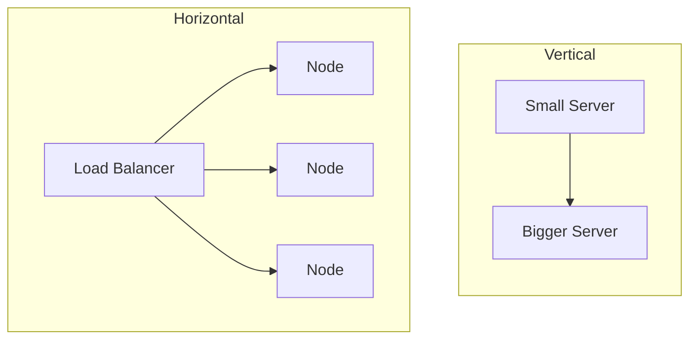

# Scalability: Vertical vs Horizontal

> A system is scalable if it can handle growing load by adding resources, ideally
> with little extra cost or complexity per unit of growth.

## Problem
Load grows: more users, more requests, more data. A design that works at 1,000
requests/sec may fall over at 100,000. Scalability is about *how* you add capacity
when that happens.

## Core concepts

**Vertical scaling (scale up)** — make one machine bigger (more CPU, RAM, disk).
- ✅ Simple — no code changes, no distribution.
- ⚠️ Hard ceiling (biggest machine you can buy), single point of failure, expensive
  at the top end.

**Horizontal scaling (scale out)** — add more machines and share the load.
- ✅ Near-unlimited headroom, fault tolerant (lose one node, others survive).
- ⚠️ Requires a load balancer, and the app should ideally be **stateless** so any
  node can handle any request.

**Stateless vs stateful** — horizontal scaling works best when servers keep no
per-user state locally. Push session/state into a shared store (Redis, DB) so
requests can hit any node.

**What else has to scale** — the app tier is the easy part. The **database** is
usually the real bottleneck and needs its own strategies (replication, sharding,
caching — see later topics).

## Trade-offs
- Start **vertical** — it's cheaper and simpler until you hit a real limit.
- Go **horizontal** when you need fault tolerance or exceed one machine's capacity.
- Horizontal scaling adds distributed-systems problems (consistency, coordination)
  — don't pay that cost before you need to.

## Real-world examples
- **Stack Overflow** famously ran for years on a small number of powerful
  (vertically scaled) servers.
- **Google / Netflix** scale horizontally across thousands of commodity machines.

## References
- *Designing Data-Intensive Applications* — Ch. 1
- [The Twelve-Factor App](https://12factor.net/) — on stateless processes
