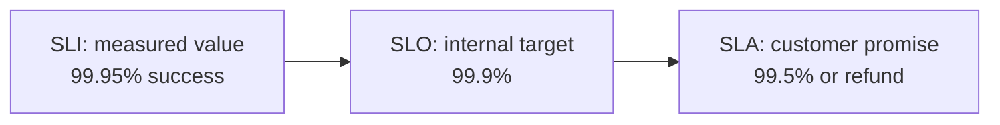

# SLA, SLO, SLI

> Three nested terms for defining and measuring reliability: **SLI** is the
> measurement, **SLO** is the target, **SLA** is the promise (with consequences).

## Problem
"The system should be reliable" is not actionable. You need a precise metric, a
target for it, and an agreement about what happens if you miss. SLI/SLO/SLA give you
exactly that, from the inside out.

## Core concepts

**SLI — Service Level Indicator** (*what you measure*)
A quantitative measure of some aspect of service. Good SLIs are ratios of good events
to total events:
- Availability = successful requests / total requests
- Latency = % of requests faster than 200ms
- Error rate, throughput, durability.

**SLO — Service Level Objective** (*your internal target*)
The target value or range for an SLI, over a window.
- e.g. "99.9% of requests succeed over a rolling 30 days."
- e.g. "p99 latency < 300ms."

**SLA — Service Level Agreement** (*the external contract*)
A formal promise to customers, usually with **financial penalties** if broken.
- e.g. "99.9% uptime monthly, or you get a 10% credit."
- SLAs are looser than SLOs by design — you set the internal SLO *stricter* so you
  catch problems before the contractual SLA is breached.

**Error budget** — the flip side of an SLO. A 99.9% SLO allows 0.1% failure = your
*error budget*. As long as you're within budget, you can ship fast / take risks; burn
it and you freeze risky changes to recover reliability. This balances velocity vs
stability with a number instead of an argument.

## Example — an error budget in numbers
**SLI:** successful requests / total. **SLO:** 99.9% success over 30 days. That allows
`0.1% × 30 days ≈ 43.2 minutes` of "failure" per month — your **error budget**. If a deploy
burns 30 minutes of it in one incident, you've spent most of the month's budget and should
**freeze risky changes** until reliability recovers. The **SLA** you sell customers is looser
(say 99.5%) so you catch problems internally before breaching the contract.

## Common tools
| Tool | Use it for |
| --- | --- |
| **Prometheus + Grafana** | computing SLIs and graphing SLO burn-down |
| **Sloth**, **Nobl9**, **Google Cloud SLO**, **Datadog SLOs** | defining/tracking SLOs + error budgets |
| **PagerDuty / Opsgenie** | alerting on burn-rate, not every blip |
| **Synthetic monitors** (Pingdom, Datadog) | measuring availability from the outside |

## Trade-offs
- **Stricter SLO → higher cost** (more redundancy, slower releases). Don't promise
  five nines for a feature that doesn't need it.
- Too many SLIs creates noise. Pick a few that reflect **user happiness** (the user
  doesn't care about CPU; they care about success + speed).

## Real-world examples
- **Google Cloud / AWS** publish SLAs (e.g. Compute Engine 99.99% monthly) with
  service-credit penalties.
- Google SRE teams gate launches and freezes on **error-budget** burn rate.

## References
- *Site Reliability Engineering* — Ch. 4 (Service Level Objectives)
- [Google SRE: SLIs, SLOs, SLAs](https://sre.google/sre-book/service-level-objectives/)
