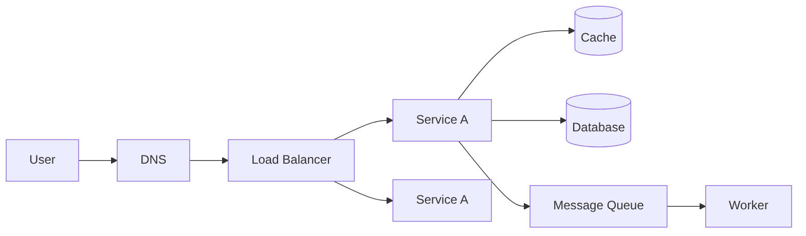
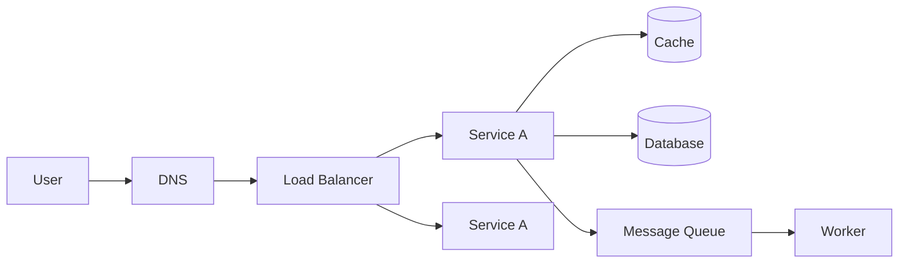

# What is System Design

> The process of defining the architecture, components, interfaces, and data flow
> of a system to satisfy a set of requirements.

## Problem
Writing code that works on one machine for one user is easy. Building a system that
serves **millions of users**, stays **available** during failures, responds
**quickly**, and can **grow** over time is hard. System design is the discipline of
making the high-level decisions — *what are the pieces, how do they talk, where does
the data live* — before and while you write the code.

## Core concepts

**Two altitudes of design**
- **High-Level Design (HLD)** — the big boxes: services, databases, caches, queues,
  load balancers, and how requests flow between them.
- **Low-Level Design (LLD)** — the inside of a box: classes, schemas, APIs,
  algorithms.

**A typical request path**

▸ Diagram source (Mermaid)

**The questions every design must answer**
1. **Functional requirements** — what must it *do*? (post a tweet, send a message)
2. **Non-functional requirements** — how *well*? (scale, latency, availability)
3. **Constraints** — budget, team, existing tech, regulations.

## Trade-offs
There is no "correct" design — only trade-offs. Every choice trades one property for
another (e.g. consistency vs availability, cost vs performance, simplicity vs
flexibility). The job is to pick the trade-offs that match the requirements, and to
**state them explicitly**.

## Real-world examples
- A startup with 100 users may run a single server + one database. That is a *good*
  design for its scale — adding queues and caches would be wasted complexity.
- The same product at 100M users needs sharding, caching, CDNs, and async
  processing. Designs evolve with scale.

## References
- *Designing Data-Intensive Applications* — Martin Kleppmann
- [System Design Primer](https://github.com/donnemartin/system-design-primer)
