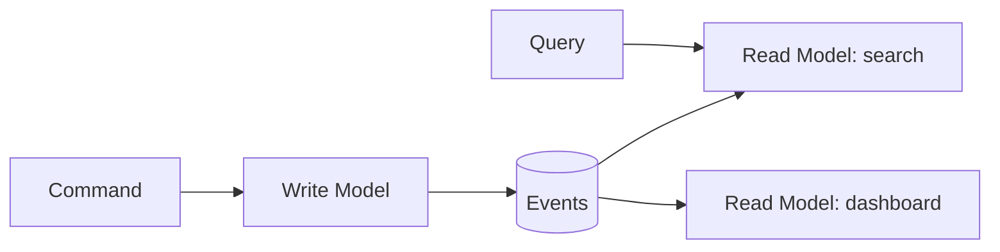

# CQRS & Event Sourcing

> **CQRS** separates the write model from the read model. **Event sourcing** stores all
> changes as an append-only log of events instead of just the current state. They're
> distinct ideas that pair well.

## Problem
A single data model optimized for both writes and complex reads is often a compromise
at both. And storing only the *current* state throws away history — you can't ask "how
did we get here?" These patterns address both.

## Core concepts

**CQRS (Command Query Responsibility Segregation)**
- **Commands** (writes) go to a write model optimized for validation/consistency.
- **Queries** (reads) hit one or more read models (denormalized, optimized per view).
- The read side is updated from the write side, often asynchronously.

**Event sourcing** — instead of `UPDATE balance = 100`, append events:
`Deposited 50`, `Deposited 70`, `Withdrew 20`. Current state is **derived by replaying
events**.
- Gives a complete **audit log**, time-travel ("state as of last Tuesday"), and easy
  rebuilding of new read models by replaying.

## Trade-offs
- ✅ Independently scalable/optimized reads and writes; full history & audit; natural
  fit with event-driven systems; rebuild projections anytime.
- ⚠️ **Significant complexity** — eventual consistency between write and read models,
  event schema/versioning, replay cost, "what's the current state?" requires
  projection. CQRS without event sourcing is lighter and often enough.
- **Use sparingly** — only for complex domains with heavy read/write asymmetry or
  strong audit needs. Overkill for simple CRUD.

## Real-world examples
- **Banking/ledgers** are naturally event-sourced (transactions are the truth).
- **E-commerce order systems** use CQRS to serve fast product/order read views while
  keeping a strict write model.

## References
- Martin Fowler — [CQRS](https://martinfowler.com/bliki/CQRS.html) ·
  [Event Sourcing](https://martinfowler.com/eaaDev/EventSourcing.html)
- [microservices.io — CQRS](https://microservices.io/patterns/data/cqrs.html)
