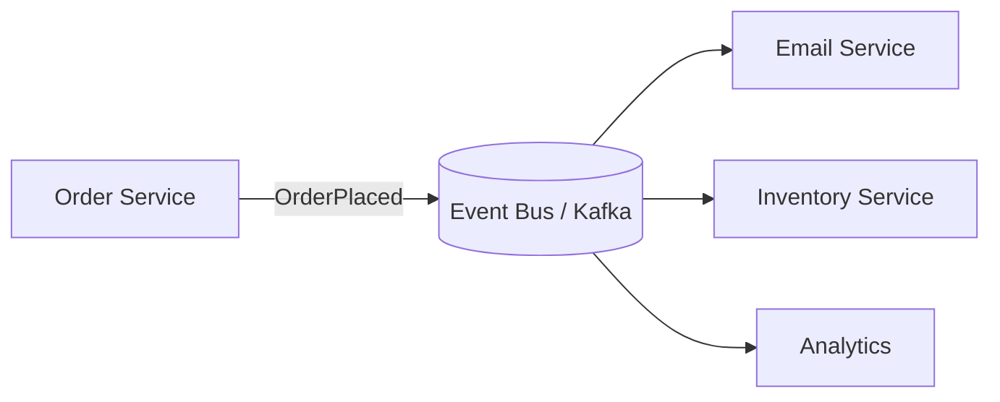

# Event-Driven Architecture

> Services communicate by producing and reacting to **events** ("something happened")
> rather than calling each other directly — promoting loose coupling.

## Problem
With direct (synchronous) calls, a service must know about every downstream consumer
and wait for them. Adding a new consumer means changing the producer. Event-driven
architecture inverts this: the producer just announces facts; anyone interested
reacts.

## Core concepts

**Events** — immutable records of something that happened (`OrderPlaced`,
`PaymentReceived`). Producers emit; consumers subscribe.

**Two common styles**
- **Event notification** — thin event ("order 42 placed"); consumers call back for
  details if needed.
- **Event-carried state transfer** — event carries the full data, so consumers don't
  need to call back (more autonomy, more duplication).

**Broker patterns** — a message broker (Kafka, RabbitMQ, SNS/SQS) delivers events.
**Log-based** brokers (Kafka) retain events so new consumers can **replay** history.

**Related ideas** — **event sourcing** (store the events as the source of truth) and
**CQRS** often pair with this (see [CQRS & event sourcing](./cqrs-event-sourcing.md)).

## Trade-offs
- ✅ Loose coupling, easy to add consumers, natural buffering/scaling, resilience,
  audit trail of what happened.
- ⚠️ **Eventual consistency**, harder to follow end-to-end flow ("where did this go?"),
  debugging/tracing across async hops, duplicate/out-of-order handling, schema
  evolution of events.
- Don't make *everything* an event — request/response is clearer when you need an
  immediate answer.

## Real-world examples
- **Uber, Netflix, LinkedIn** run large Kafka-based event pipelines.
- E-commerce: one `OrderPlaced` event fans out to payment, inventory, shipping, email,
  and analytics independently.

## References
- Martin Fowler — [Event-Driven](https://martinfowler.com/articles/201701-event-driven.html)
- [Kafka](https://kafka.apache.org/)
