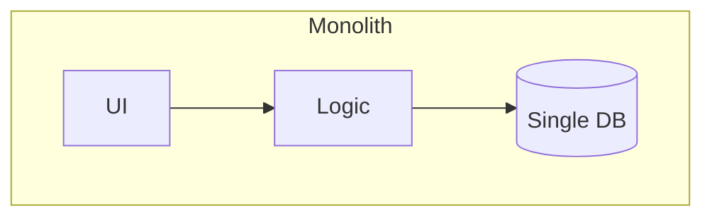
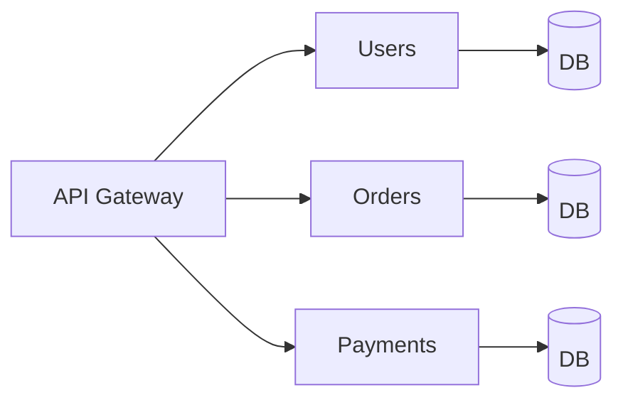

# Monolith vs Microservices

> A **monolith** is one deployable application containing all features. **Microservices**
> split the system into many small, independently deployable services owning their own
> data.

## Problem
As an app and team grow, a single codebase can become hard to change, test, and deploy
without everyone stepping on each other. Microservices promise independence — at the
cost of distributed-systems complexity. The choice is a major architectural commitment.

## Core concepts

**Monolith** — one codebase, one deploy, one (usually) shared database.

- ✅ Simple to build, test, deploy, debug; no network between modules; one transaction.
- ⚠️ Tight coupling, scale the whole app even to grow one part, big-bang deploys,
  hard for large teams to work in parallel.

**Microservices** — many services, each with its **own database**, communicating over
the network (REST/gRPC/events).

- ✅ Independent deploy & scaling, team autonomy, tech diversity, fault isolation.
- ⚠️ Distributed complexity: network failures, **eventual consistency**, distributed
  transactions (sagas), service discovery, observability, deployment overhead.

## Example — one deploy becomes many
A monolithic shop (`UI + orders + payments + inventory` in one codebase, one DB, one deploy)
is split into **User**, **Order**, **Payment**, and **Inventory** services — each with its
**own database**, deployed independently, talking over REST/gRPC/events behind an API
gateway. Now the payments team ships without redeploying everything, and inventory can scale
on its own. The cost: network calls, eventual consistency, and distributed-systems
complexity. The [saga](../../3-practice/project-saga.md) and
[event-driven](../../3-practice/project-event-driven-orders.md) projects show the glue.

## Common tools
| Tool | Use it for |
| --- | --- |
| **Docker + Kubernetes** | packaging & running many services |
| **FastAPI / Spring Boot / Go** | building individual services |
| **gRPC / REST / Kafka** | inter-service communication |
| **Istio / Linkerd (service mesh)** | traffic, retries, mTLS, observability between services |
| **API gateway** (Kong, API Gateway) | the single front door |

## Trade-offs
- **Start with a (well-structured / modular) monolith.** Most products never need
  microservices; premature splitting adds huge operational cost.
- Split when you have *real* drivers: large teams needing independent deploys,
  components with very different scaling needs, or clear bounded contexts.
- Define service boundaries around **business domains** (DDD bounded contexts), not
  technical layers. Each service owns its data — no shared database.

## Real-world examples
- **Amazon, Netflix, Uber** moved monolith → microservices as they scaled to thousands
  of engineers.
- Many successful companies (**Shopify, Stack Overflow**) run large, deliberate
  **monoliths** ("majestic monolith").

## References
- Martin Fowler — [Microservices](https://martinfowler.com/articles/microservices.html)
- Martin Fowler — [MonolithFirst](https://martinfowler.com/bliki/MonolithFirst.html)
