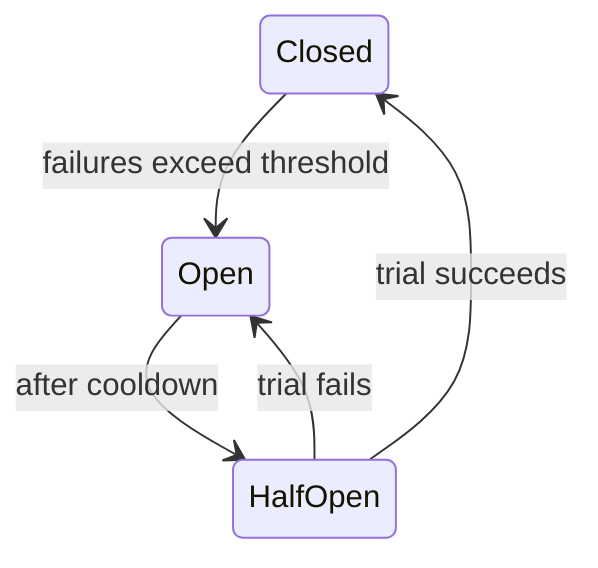

# Circuit Breaker, Bulkhead & Resilience Patterns

> A toolkit of patterns that stop a failure in one part of a distributed system from
> cascading into a total outage.

## Problem
In a network of services, one slow or failing dependency can back up callers, exhaust
their threads/connections, and drag the whole system down — a **cascading failure**.
Resilience patterns contain the blast radius.

## Core concepts

**Circuit breaker** — wraps calls to a dependency and tracks failures. Like an
electrical breaker, it has three states:

- **Closed** — calls flow normally.
- **Open** — calls fail fast (no waiting on a dead service), giving it time to recover.
- **Half-open** — let a few trial calls through to test recovery.

**Bulkhead** — isolate resources (separate thread/connection pools per dependency) so
one saturated dependency can't starve the others — like watertight compartments in a
ship.

**Retry with backoff + jitter** — retry transient failures, but with **exponential
backoff** and randomized **jitter** to avoid synchronized retry storms (thundering
herd). Only retry **idempotent** operations.

**Timeouts** — never wait forever; every remote call needs a sensible timeout.

**Fallback / graceful degradation** — return a default, cached, or partial response
when a dependency is down (e.g. show generic recommendations).

**Rate limiting / load shedding** — drop or reject excess load to protect the core.

## Example — a circuit breaker in action
A service calls a flaky dependency. You wrap the call with a **timeout** (fail fast instead
of hanging), a **retry** with backoff, and a **circuit breaker**: after 3 consecutive
failures the breaker **opens**, so further calls **fail instantly** and return a **fallback**
(cached/default) instead of piling up and exhausting threads. After a cooldown it goes
half-open to test recovery. The service stays responsive even while the dependency is down.
Built in the [resilience project](../../3-practice/project-resilience.md).

## Common tools
| Tool | Use it for |
| --- | --- |
| **resilience4j** (Java), **Polly** (.NET), **pybreaker** (Python) | in-process circuit breakers/retries |
| **Istio / Envoy (service mesh)** | timeouts, retries, circuit breaking at the infra layer |
| **Netflix Hystrix** | the pattern's origin (now superseded by resilience4j) |
| **SQS + DLQ** | async retries / poison-message isolation |

## Trade-offs
- These add resilience but also complexity and tuning (thresholds, timeouts, pool
  sizes). Bad settings can cause false trips or hide problems.
- Retries can *worsen* an overload if not bounded with backoff + circuit breakers.
- Use a library (resilience4j, Polly, Envoy/service mesh) rather than rolling your own.

## Real-world examples
- **Netflix Hystrix** popularized circuit breakers + bulkheads (now resilience4j /
  service meshes).
- **Service meshes (Istio/Envoy)** provide retries, timeouts, and circuit breaking at
  the infrastructure layer.

## References
- Michael Nygard, *Release It!*
- [Hystrix wiki](https://github.com/Netflix/Hystrix/wiki) · [resilience4j](https://resilience4j.readme.io/)
