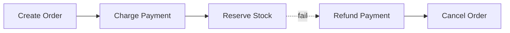

# Saga Pattern (Distributed Transactions)

> A saga manages a transaction that spans multiple services as a sequence of local
> transactions, using **compensating actions** to undo steps if something fails — since
> a single ACID transaction across services isn't possible.

## Problem
In microservices each service owns its own database. A business operation like "place
order" touches Orders, Payment, and Inventory — three databases. You can't wrap them in
one ACID transaction. How do you keep data consistent when step 3 fails after steps 1
and 2 succeeded?

## Core concepts

**Local transactions + compensation** — each step commits locally; if a later step
fails, run **compensating transactions** to undo the earlier ones (semantically — e.g.
refund, not literal rollback).

**Two coordination styles**
- **Choreography** — no central coordinator; each service listens for events and emits
  the next. Simple, decentralized; but the flow is implicit and hard to follow at
  scale.
- **Orchestration** — a central **orchestrator** tells each service what to do and
  handles failures/compensation. Explicit and easier to monitor; the orchestrator is a
  dependency to manage.

## Trade-offs
- ✅ Enables consistency across services without distributed locks; resilient.
- ⚠️ **Eventual consistency** (intermediate states are visible — an order can be
  "pending"); compensations must be designed for every step and can be tricky (you
  can't always perfectly undo); steps must be **idempotent**; no isolation, so you may
  need semantic locks/state flags.
- Choreography = loose & simple but opaque; orchestration = clear & controllable but
  centralized.

## Real-world examples
- **E-commerce checkout** (order → payment → inventory → shipping) with refunds/cancels
  as compensations.
- **Travel booking** (flight + hotel + car) — cancel the others if one fails.

## References
- [microservices.io — Saga](https://microservices.io/patterns/data/saga.html)
- Chris Richardson, *Microservices Patterns*
