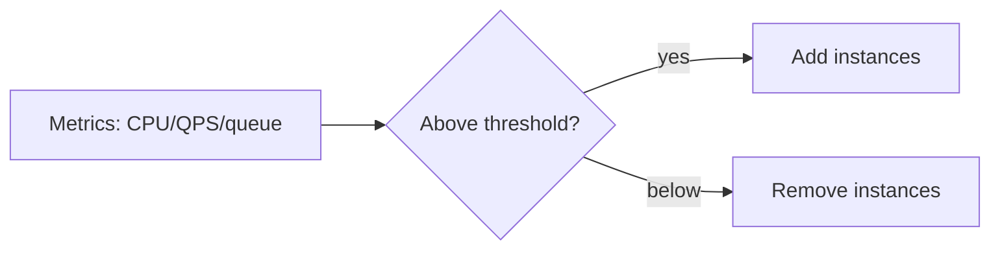

# Capacity Planning

> Estimating the resources (compute, memory, storage, bandwidth) a system needs to meet
> demand — now and as it grows — without over- or under-provisioning.

## Problem
Too little capacity → outages and slow responses under load. Too much → wasted money.
Capacity planning finds the right amount, and ensures you can scale before demand
outpaces supply (launches, seasonal peaks, viral spikes).

## Core concepts

**Start from the numbers** — use [estimation](../fundamentals/estimation.md): expected
QPS (peak, not average), data growth rate, payload sizes, and per-request resource cost.

**Headroom & peaks** — provision for **peak** load plus a safety margin (e.g. target
~60–70% utilization) so you can absorb spikes and lose a node without tipping over.

**Scaling approaches**
- **Vertical / horizontal** scaling (see [scalability](../fundamentals/scalability.md)).
- **Autoscaling** — add/remove instances automatically based on metrics (CPU, QPS,
  queue depth). Reactive autoscaling lags fast spikes; **predictive/scheduled** scaling
  helps for known patterns (Monday morning, Black Friday).

**Load & stress testing** — measure real capacity: **load test** to expected peak,
**stress test** past it to find the breaking point, and run **soak tests** to catch
leaks over time. Tools: k6, JMeter, Locust, Gatling.

**Plan for growth** — track utilization trends and lead times (some resources take days
to provision); plan headroom for the next N months.

## Trade-offs
- Over-provision = reliability + cost; under-provision = savings + risk. Autoscaling
  balances this but has limits (cold starts, scaling lag, downstream bottlenecks like a
  single DB that can't autoscale writes).
- Load tests cost effort but are the only way to know real limits — guesses are often
  off by an order of magnitude.

## Real-world examples
- **Black Friday / ticket on-sales** — pre-scale and load-test ahead of known spikes.
- **Kubernetes HPA / cloud autoscaling groups** scale app tiers on CPU/custom metrics;
  the database tier usually needs separate, deliberate capacity planning.

## References
- *Site Reliability Engineering* — software engineering for capacity planning
- [k6 load testing](https://k6.io/)
