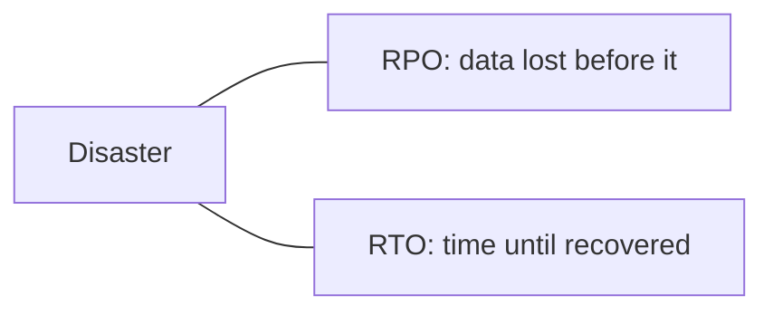

# Disaster Recovery & Backups

> **Backups** are copies of data you can restore from. **Disaster recovery (DR)** is the
> plan and infrastructure to bring the whole system back after a major failure (region
> outage, data corruption, ransomware).

## Problem
Redundancy handles component failures, but some disasters take out everything at once —
a whole region, an accidental `DELETE`, corruption that replicates to all replicas, or
a security incident. You need a way to recover that doesn't depend on the failed system.

## Core concepts

**Two key objectives**
- **RPO (Recovery Point Objective)** — how much **data loss** you can tolerate (how far
  back the last good backup is). RPO = 5 min → back up at least every 5 min.
- **RTO (Recovery Time Objective)** — how long you can be **down** while recovering.

**Backup principles**
- **3-2-1 rule** — 3 copies, on 2 media types, 1 off-site.
- **Test restores** — an untested backup is not a backup. Verify you can actually
  restore.
- Protect against **logical** errors too — replication faithfully copies a bad
  `DELETE`; **point-in-time** backups/snapshots let you roll back.

**DR strategies (cost vs RTO)**
- **Backup & restore** — cheapest, slowest (hours+).
- **Pilot light** — core systems running minimally, scale up on disaster.
- **Warm standby** — a scaled-down running copy, scale up to take over.
- **Hot standby / multi-site active-active** — full live copy, near-zero RTO/RPO, most
  expensive.

## Trade-offs
- Lower RPO/RTO = more cost and complexity. Set them per business need (a bank's ledger
  ≠ a marketing blog).
- Multi-region DR adds latency/consistency challenges and expense; backup-and-restore
  is cheap but means long downtime.

## Real-world examples
- **Database point-in-time recovery** (PITR) to roll back before a bad migration.
- **Multi-region failover** runbooks (e.g. promote a standby region) tested via game
  days / DR drills.

## References
- [AWS Disaster Recovery strategies](https://docs.aws.amazon.com/whitepapers/latest/disaster-recovery-workloads-on-aws/disaster-recovery-options-in-the-cloud.html)
- *Site Reliability Engineering* — data integrity chapter
