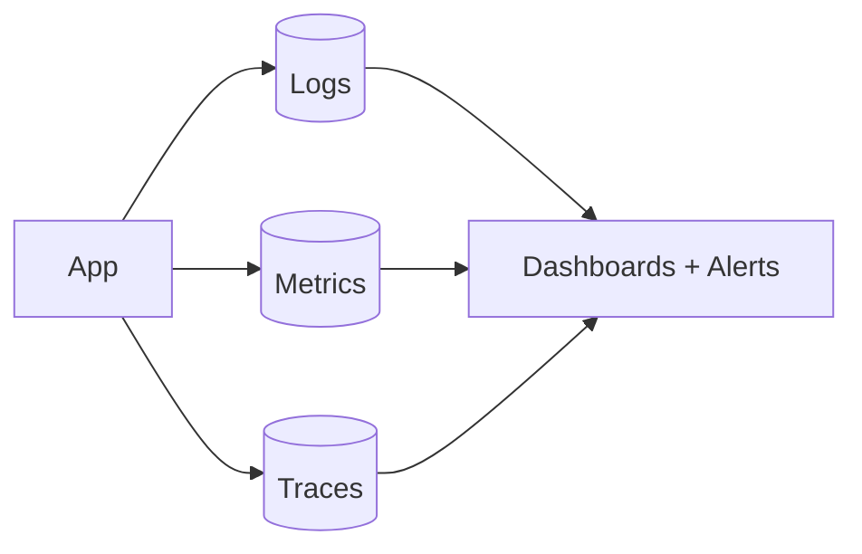

# Monitoring, Logging & Observability

> **Observability** is the ability to understand a system's internal state from its
> outputs. Its three pillars are **logs, metrics, and traces**.

## Problem
In a distributed system you can't attach a debugger to production. When something
breaks at 3am, you need to answer "what's wrong, where, and why?" from data the system
already emits. Without observability you're flying blind.

## Core concepts

**The three pillars**
- **Logs** — timestamped records of discrete events. Great for detail/forensics. Use
  **structured** logs (JSON) and a **correlation/trace ID** to follow one request.
- **Metrics** — numeric time-series (request rate, error rate, latency, CPU). Cheap to
  store, ideal for dashboards and alerts.
- **Traces** — follow a single request across many services, showing where time went
  (**distributed tracing**).

**Monitoring vs observability** — monitoring watches **known** failure modes (set
alerts on them); observability lets you investigate **unknown** ones you didn't predict.

**What to measure — the Four Golden Signals** (Google SRE): **Latency, Traffic,
Errors, Saturation**. (RED method: Rate, Errors, Duration; USE: Utilization,
Saturation, Errors.)

**Alerting** — alert on **symptoms users feel** (high error rate, slow p99), not every
internal blip. Avoid alert fatigue; page only on actionable, urgent issues.

## Trade-offs
- More telemetry = better insight but more **cost and noise**; sample high-volume
  traces/logs.
- Logs are detailed but expensive at scale; metrics are cheap but low-cardinality;
  traces are powerful but need instrumentation. Use all three together.

## Real-world examples
- **Prometheus + Grafana** (metrics + dashboards), **ELK / Loki** (logs), **Jaeger /
  Tempo / OpenTelemetry** (traces); **Datadog** as an all-in-one.
- A correlation ID flowing through all services lets you reconstruct one user's failing
  request end-to-end.

## References
- *Site Reliability Engineering* — Ch. 6 (Monitoring) ·
  [Four Golden Signals](https://sre.google/sre-book/monitoring-distributed-systems/)
- [OpenTelemetry](https://opentelemetry.io/)
