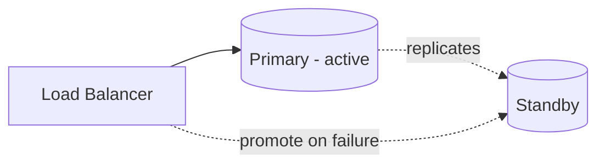

# Redundancy & Failover

> **Redundancy** = running spare copies of components so there's no single point of
> failure. **Failover** = automatically switching to a healthy copy when one fails.

## Problem
Everything fails eventually — disks, servers, racks, networks, whole datacenters. If
any single component being down takes the system down, you can't be highly available.
Redundancy removes single points of failure (SPOFs); failover makes the switchover
automatic and fast.

## Core concepts

**Find and eliminate SPOFs** — trace every request; anything with only **one** of it
(one LB, one DB, one region) is a SPOF. Run at least two.

**Redundancy models**
- **Active-passive (failover)** — primary serves traffic; a standby takes over when it
  dies. Standby capacity sits idle. Simpler.
- **Active-active** — all instances serve traffic and share load; losing one just
  reduces capacity. Better utilization & availability; needs load balancing + state
  sharing.



**Failover mechanics**
- **Health checks / heartbeats** detect failure.
- **Promotion** — a replica becomes primary; traffic is redirected (via LB, DNS, or a
  virtual IP).
- **Beware split-brain** — two nodes both think they're primary. Prevent with quorum/
  consensus (ZooKeeper, etcd, Raft) and fencing.

**Levels of redundancy** — instance → availability zone → region. Multi-AZ survives a
datacenter outage; multi-region survives a regional one.

## Example — database failover
A primary database has a synchronous **standby** in another availability zone. A health
check/heartbeat monitors the primary. When it dies:
```
primary (AZ-a) ──sync replication──► standby (AZ-b)
        ✗ fails
        → standby is PROMOTED to primary, DNS/endpoint repointed (~60–120s)
```
Clients reconnect to the new primary; no data is lost (sync). The key risks to design
around: **split-brain** (two primaries) — prevented with quorum/consensus — and testing that
failover *actually* works.

## Common tools
| Tool | Use it for |
| --- | --- |
| **AWS RDS Multi-AZ / Aurora** | managed synchronous standby + auto-failover |
| **Patroni + etcd**, **repmgr** | Postgres leader election / failover |
| **keepalived (VRRP)** | floating/virtual IP failover for LBs |
| **Route 53 health checks** | DNS failover across regions |
| **Kubernetes** | reschedules pods off dead nodes automatically |

## Trade-offs
- More redundancy = higher availability but more **cost** and **complexity**.
- Active-active uses resources efficiently but needs state coordination; active-passive
  wastes standby capacity but is simpler.
- Automatic failover is fast but risks flapping/split-brain; manual is safer but slow.
- **Failover must be tested** — untested failover often doesn't work when you need it.

## Real-world examples
- **Multi-AZ RDS** keeps a synchronous standby and fails over automatically.
- **Cloud load balancers** health-check instances and reroute around failures.

## References
- *Site Reliability Engineering* (Google)
- [AWS Well-Architected: Reliability Pillar](https://docs.aws.amazon.com/wellarchitected/latest/reliability-pillar/welcome.html)
