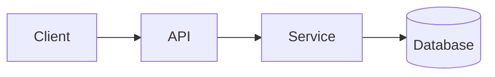

# Case Study: <System Name>

> One-line description of what we're designing.

## 1. Requirements
**Functional**
- ...

**Non-functional**
- Scale, latency, availability targets

## 2. Estimations
Back-of-the-envelope: traffic (QPS), storage, bandwidth.

## 3. High-level design

## 4. Data model & API
Key tables/collections and the main API endpoints.

## 5. Deep dives
The hard parts — e.g. how the feed is generated, how messages are delivered,
hot-key handling, consistency choices.

## 6. Trade-offs & bottlenecks
What we optimized for, what we gave up, where it breaks at scale.

## 7. References
- ...
