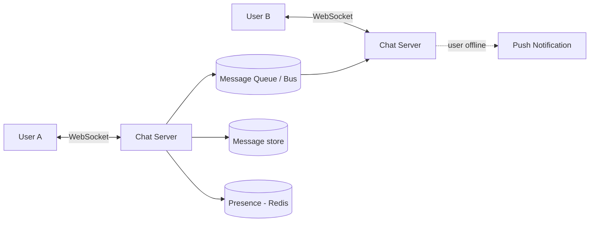

# Case Study: Chat System (WhatsApp / Messenger)

> Design a real-time messaging system supporting 1:1 and group chat, online presence,
> delivery receipts, and offline message delivery.

## 1. Requirements
**Functional**
- Send/receive messages in real time (1:1 and group).
- Online/last-seen presence; delivery + read receipts.
- Store and deliver messages sent while a user is offline.

**Non-functional**
- Low latency, highly available, ordered delivery within a conversation.
- Massive concurrent persistent connections.

## 2. Estimations
- 500M DAU, 40 messages/day → 20B messages/day → ~230K writes/sec.
- Hundreds of millions of **concurrent WebSocket connections**.

## 3. High-level design

## 4. Data model & API
- `messages`: `message_id, conversation_id, sender_id, content, created_at, status`
  — partitioned by `conversation_id`, ordered by time.
- `conversations` / `participants`.
- A **wide-column store (Cassandra/HBase)** suits the huge write volume + time-ordered
  reads.

**Protocol** — persistent **WebSocket** (or MQTT, which WhatsApp uses) for bidirectional
real-time push.

## 5. Deep dives
**Connection routing** — each user holds a WebSocket to *some* chat server. A
**session/presence registry** (Redis) maps `user_id → server`. To deliver a message,
look up the recipient's server and forward (via the registry or a message bus); if the
user is on another node, route through the bus.

**Online presence** — clients send periodic **heartbeats**; Redis stores
`user_id → last_seen/status` with a TTL. Missed heartbeats → offline. Fan-out presence
changes only to contacts who are watching.

**Offline delivery** — if the recipient is offline, persist the message and deliver on
reconnect; also trigger a **push notification** (APNs/FCM). Track per-message status:
sent → delivered → read.

**Ordering** — assign sequence numbers per conversation so clients can order/dedupe
messages.

**Group chat** — fan out to all members' servers; large groups are limited or use a
fan-out service.

## 6. Trade-offs & bottlenecks
- Persistent connections are **stateful** → need a presence registry + message bus to
  scale horizontally; sticky routing.
- Strong per-conversation ordering vs global ordering (only need per-conversation).
- Store-and-forward + push for offline; balance receipt accuracy vs chattiness.

## 7. References
- [Grokking the System Design Interview — Messenger/WhatsApp](https://www.designgurus.io/)
- [System Design Primer](https://github.com/donnemartin/system-design-primer)
