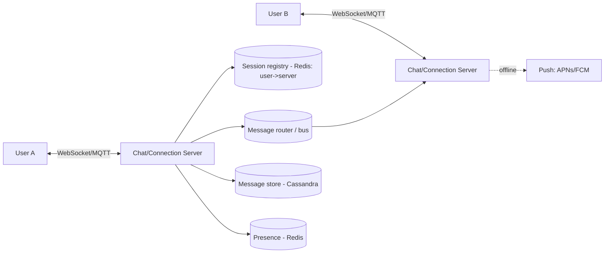
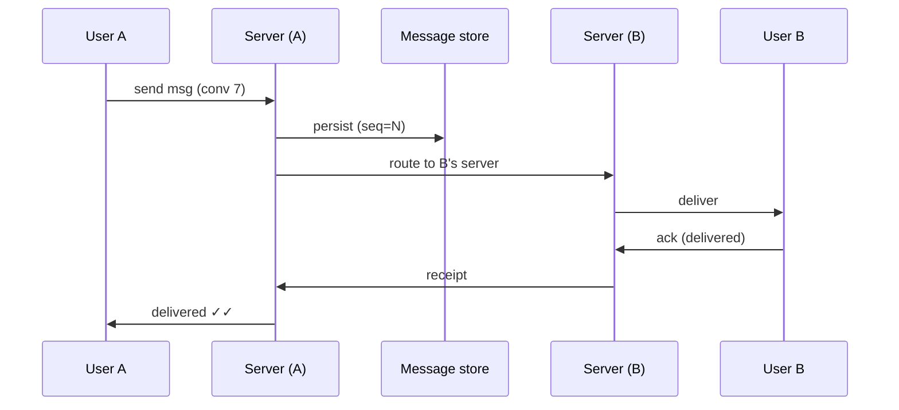

# Case Study: Chat System (WhatsApp / Messenger)

> Design a real-time messaging system supporting 1:1 and group chat, online presence,
> delivery receipts, and offline message delivery.

## 1. Requirements

**Clarifying questions**
- 1:1 only or groups too? Max group size? Media/voice/video?
- Message history retention — forever or limited? End-to-end encryption?
- Receipts (sent/delivered/read) and typing indicators? Multi-device?

**Functional**
- Send/receive messages in real time, 1:1 and group.
- Online/last-seen **presence**; **delivery + read receipts**.
- **Offline delivery** — store messages for offline users, deliver on reconnect, plus a
  push notification.

**Non-functional**
- **Low latency** (< ~100 ms in-region), **highly available**.
- **Ordered** delivery within a conversation.
- Support **hundreds of millions of concurrent persistent connections**.

## 2. Capacity estimation
- **500M DAU**, ~40 messages/day → 20B messages/day ≈ **230K writes/s** avg, peak
  much higher.
- **Concurrent connections**: a large fraction of DAU online → **100M+ simultaneous
  WebSocket/MQTT connections**. A single box handles ~100K–1M connections → need
  thousands of connection servers.
- **Storage**: 20B msgs/day × ~200 B ≈ 4 TB/day (before media). Media in object
  storage.

## 3. High-level architecture

## 4. Data model & API
- `messages`: `message_id (snowflake), conversation_id, sender_id, content, created_at,
  seq, status` — **partitioned by `conversation_id`**, clustered by `seq`/time.
- `conversations`, `participants(conversation_id, user_id, last_read_seq)`.
- **Wide-column store (Cassandra/HBase/ScyllaDB)** fits: huge write volume + "load
  recent messages in a conversation" reads (see [Discord case
  study](./companies/discord.md)).

**Protocol** — a persistent **WebSocket** (or **MQTT**, which WhatsApp uses for low
overhead on mobile). Messages flow over this bidirectional channel.

## 5. Deep dives

**Connection management & routing** — each online user holds a long-lived connection to
*some* connection server. A **session registry** (Redis) maps `user_id → server_id`. To
deliver a message:
1. Sender's server persists the message and looks up the recipient's server.
2. It forwards the message (directly or via a **message bus**) to that server.
3. That server pushes it down the recipient's open socket.

**Online presence** — clients send periodic **heartbeats**; Redis holds
`user_id → {status, last_seen}` with a TTL. Missed heartbeats → offline. Don't broadcast
presence to everyone — only fan out changes to contacts currently viewing the user
(subscribe on chat open).

**Offline delivery & receipts** — if the recipient is offline, the message is persisted
and queued for delivery on reconnect, and a **push notification** (APNs/FCM) is sent.
Track status transitions **sent → delivered → read** (update `last_read_seq` per
participant).

**Ordering & dedup** — assign a monotonic **sequence number per conversation** so
clients can order and de-duplicate; only **per-conversation** ordering is needed (not
global), which is cheap.

**Group chat** — write once, fan out to each member's connection server (look up each in
the registry). Very large groups use a dedicated fan-out service and may cap size; the
message is stored once per conversation, not per member.

**Media & E2E encryption** — upload media to object storage (get a URL); send the URL in
the message. For E2E (Signal protocol), the server only relays ciphertext and can't read
content — which constrains server-side search/receipts.

## 6. Trade-offs & bottlenecks
- Persistent connections are **stateful** → need a session registry + message bus to
  scale horizontally; connection servers are the scaling unit (CPU = open sockets).
- **Per-conversation ordering** (cheap) vs global ordering (unnecessary).
- Store-and-forward + push for reliability of offline delivery.
- Presence fan-out can be a hidden cost → scope it to active viewers.
- Cassandra hot partitions for very active conversations → bucket partitions by time.

## 7. References
- [How Discord stores trillions of messages](https://discord.com/blog/how-discord-stores-trillions-of-messages)
- [WhatsApp / MQTT architecture talks](https://highscalability.com/)
- *Designing Data-Intensive Applications*
