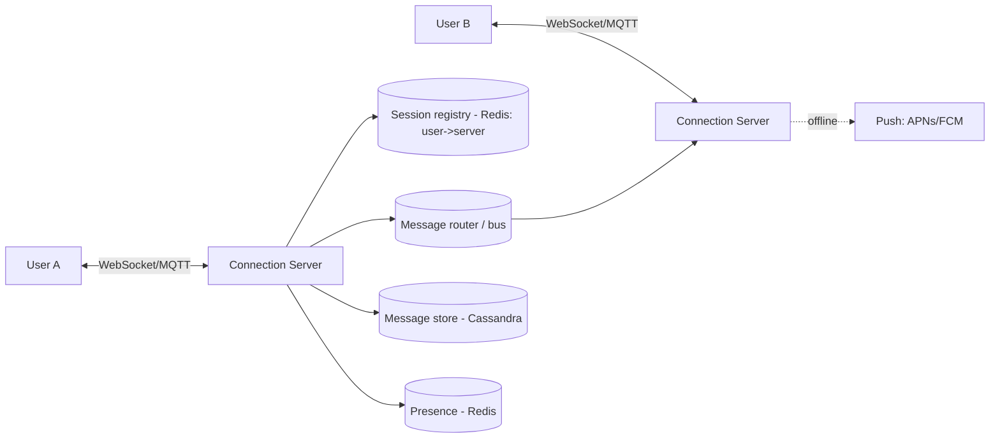
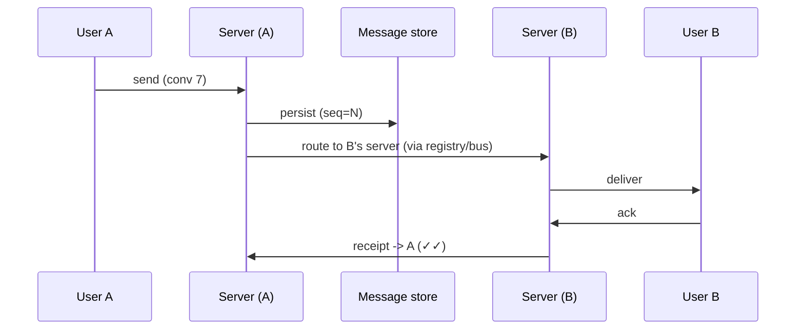

# Case Study: Chat System (WhatsApp / Messenger)

> Design a real-time messaging system supporting 1:1 and group chat, online presence,
> delivery receipts, and offline message delivery.

## 1. Requirements

**Clarifying questions**
- 1:1 only or groups? Max group size? Media/voice/video?
- History retention — forever or limited? End-to-end encryption? Multi-device?
- Receipts (sent/delivered/read) and typing indicators?

**Functional requirements**
1. Send/receive messages in real time (1:1 and group).
2. **Online/last-seen presence**.
3. **Delivery + read receipts**.
4. **Offline delivery** — store for offline users, deliver on reconnect + push.
5. Message history retrieval (scroll back).

**Non-functional requirements** (with concrete targets)
| Requirement | Target | Why |
| --- | --- | --- |
| Delivery latency | **< 100 ms** in-region | real-time feel |
| Concurrent connections | **100M+** persistent | most DAU stay connected |
| Ordering | **per-conversation, monotonic** | messages must read in order |
| Availability | **99.99%** | messaging is critical |
| Durability | **no lost messages** | losing a message is unacceptable |
| Delivery guarantee | **at-least-once + dedup** | exactly-once is impractical |

**Scale assumptions** — 500M DAU, ~40 msgs/user/day (20B/day), large fraction online
simultaneously.

**Out of scope (or note as extensions)** — voice/video transport, full E2E crypto
protocol, spam/abuse.

**🎯 The dominant requirement:** **real-time delivery over hundreds of millions of stateful
connections, reliably.** The design centers on managing persistent connections and routing
a message to wherever the recipient currently is — online or offline.

## 2. Capacity estimation
- **20B messages/day** ≈ **230K writes/s** avg, much higher at peak.
- **100M+ concurrent connections**; one server handles ~100K–1M → thousands of connection
  servers.
- Storage: 20B × ~200 B ≈ **4 TB/day** (before media).

## 3. High-level architecture

## 4. Data model & API
- `messages`: `message_id (snowflake), conversation_id, sender_id, content, created_at,
  seq, status` — **partitioned by `conversation_id`**, clustered by `seq`.
- `participants`: `conversation_id, user_id, last_read_seq`.
- **Wide-column store** (Cassandra/ScyllaDB) for write volume + recent-message reads.

**Protocol** — persistent **WebSocket** (or **MQTT**, used by WhatsApp for low mobile
overhead).

---

## 5. Deep analysis — biggest problems & solutions

Each problem follows the same walkthrough: **scenario → why it's hard → naive approach &
why it fails → solution → how it works → trade-offs → rule of thumb.**

### 🔴 Problem 1 — Routing a message across 100M+ stateful connections

**Scenario.** User A is connected to connection-server #417; User B is connected to
server #1902 (out of thousands). A sends B a message. How does #417 get it onto B's socket?

**Why it's hard.** Connection servers are **stateful** — each holds live sockets. You can't
statelessly load-balance the delivery; you must find *which* server currently holds the
recipient and deliver there.

**Naive approach & why it fails.** *Broadcast every message to all connection servers and
let the one holding B deliver it* → wastes enormous bandwidth/CPU (thousands of servers
inspect every message). *Or store the socket in a server-local map only* → other servers
can't find B.

**Solution — a shared session registry + a message router/bus.** A Redis-backed registry
maps `user_id → connection_server`. Delivery looks up the recipient's server and forwards
the message there (directly or via a pub/sub bus); that server pushes it down B's socket.

**How it works (step by step).**

1. On connect, each server records `user_id → server_id` in the registry.
2. Sender's server persists the message and looks up the recipient's server.
3. It forwards the message; the recipient's server pushes it to the socket.
4. On server failure, affected clients reconnect and re-register elsewhere.

**Trade-offs.** The registry is an extra dependency (and must be fast/replicated), but it
turns an O(all servers) broadcast into an O(1) lookup + direct delivery.

**💡 Rule of thumb:** with stateful connections, keep a fast directory of "who's connected
where" and route point-to-point.

### 🔴 Problem 2 — Message ordering & deduplication

**Scenario.** Because delivery is at-least-once and may retry, B occasionally receives the
same message twice, or two near-simultaneous messages arrive out of order — and the
conversation looks scrambled.

**Why it's hard.** Networks reorder and redeliver; multiple servers/paths are involved; yet
a conversation must read in one consistent order on every device.

**Naive approach & why it fails.** *Order by client send-time / server receive-time* → clocks
differ across devices and servers (skew), so ordering is unstable and duplicates aren't
detected.

**Solution — a monotonic sequence number per conversation + dedup by message_id.** Assign a
per-conversation `seq` when persisting; clients sort by `seq` and discard already-seen
`message_id`s.

**How it works.** The conversation's partition issues increasing `seq` values; each message
carries a unique `message_id` (snowflake). Clients keep the highest seq seen and ignore
duplicates. Only **per-conversation** ordering is required (cheap), not global ordering.

**Trade-offs.** Per-conversation sequencing is simple and scales (each conversation is
independent); global ordering would need expensive coordination and isn't needed.

**💡 Rule of thumb:** order within the smallest scope that matters (the conversation), and
dedup by a stable unique id.

### 🔴 Problem 3 — Delivering to offline users (+ receipts)

**Scenario.** A messages B, but B's phone is off. The message must not be lost, must arrive
when B reconnects, and A wants to see ✓ (sent) → ✓✓ (delivered) → blue (read).

**Why it's hard.** The recipient isn't connected, so you can't push immediately; you also
need to track and report status changes back to the sender.

**Naive approach & why it fails.** *Only deliver to currently-connected users* → messages to
offline users vanish. *Keep retrying the push forever* → wasteful and still no durable
record.

**Solution — store-and-forward + push notifications + status tracking.** Persist every
message immediately. If the recipient is offline (registry miss), queue it for delivery on
reconnect and fire a **push notification** (APNs/FCM). Track `sent → delivered → read`.

**How it works.** On send, persist first (durability). Registry hit → deliver now; miss →
mark pending and trigger push. On reconnect, the client pulls pending messages by
conversation since its last `seq`. Acks drive status: delivered when B's device receives it,
read when B opens the chat (`last_read_seq` advances).

**Trade-offs.** Always-persist guarantees durability at the cost of a write per message;
push depends on third-party APNs/FCM (best-effort wake-up).

**💡 Rule of thumb:** persist before you deliver; for offline users, store-and-forward and
let push wake the device.

### 🔴 Problem 4 — Presence at scale

**Scenario.** A user with 1,000 contacts comes online. Naively, you'd notify all 1,000; do
that for millions of users flapping online/offline and you have a fan-out storm.

**Why it's hard.** Presence changes are frequent and many-to-many; broadcasting every change
to every contact is O(users × contacts).

**Naive approach & why it fails.** *Push every online/offline transition to all of a user's
contacts* → a thundering herd of presence updates that dwarfs actual messaging traffic.

**Solution — heartbeats + TTL + scoped fan-out.** Track presence with periodic heartbeats
into Redis with a TTL, and only notify contacts who are **currently looking** at the user.

**How it works.** Clients send heartbeats every N seconds; Redis stores `user_id →
{status,last_seen}` with a TTL (missed heartbeats → auto-offline via expiry). When a user
opens a chat/contact, they **subscribe** to that contact's presence; only subscribers get
updates. Last-seen is read on demand.

**Trade-offs.** Scoped fan-out drastically cuts presence traffic; the cost is that presence
is only actively pushed to interested viewers (which is all that's needed).

**💡 Rule of thumb:** compute/push presence only for who's actually watching, and let TTLs
handle "went offline."

### 🔴 Problem 5 — Storing trillions of messages with fast recent-reads

**Scenario.** Years of history accumulate (trillions of messages), yet the common read is
"load the latest ~50 messages in this conversation, fast," plus scroll-back.

**Why it's hard.** Enormous write volume + huge total size; naive partitioning creates
**hot partitions** (busy chats) and **unbounded partitions** that slow reads (see
[Discord](./companies/discord.md)).

**Naive approach & why it fails.** *Store all of a conversation's messages in one partition*
→ a busy group's partition grows without bound and gets hammered; deletes/edits leave
tombstones that slow scans.

**Solution — a wide-column store partitioned by `(conversation_id, time_bucket)`.** Bucket
messages into time windows so partitions stay bounded and time-ordered.

**How it works.** Partition key = `conversation_id` + a coarse time bucket (e.g. per week);
clustering key = `seq`/time. "Recent messages" reads the latest bucket(s); scroll-back pages
older buckets. Old buckets age out cleanly. Media goes to object storage; the message stores
only the URL.

**Trade-offs.** Bucketing adds a little read logic (which buckets to query) but bounds
partition size and keeps recent reads fast and cheap.

**💡 Rule of thumb:** partition time-series-like data by entity **and** a time bucket to cap
partition size and keep recent reads fast.

---

## 6. Trade-offs & bottlenecks (summary)
- Stateful connections → session registry + bus; connection servers scale by socket count.
- **Per-conversation** ordering (cheap) vs global (unnecessary).
- At-least-once + dedup (practical) vs exactly-once (hard).
- Presence fan-out scoped to active viewers to avoid storms.
- Hot partitions for very active chats → time-bucketed partitions.

## 7. References
- [How Discord stores trillions of messages](https://discord.com/blog/how-discord-stores-trillions-of-messages)
- [WhatsApp / MQTT architecture talks](https://highscalability.com/)
- *Designing Data-Intensive Applications*
