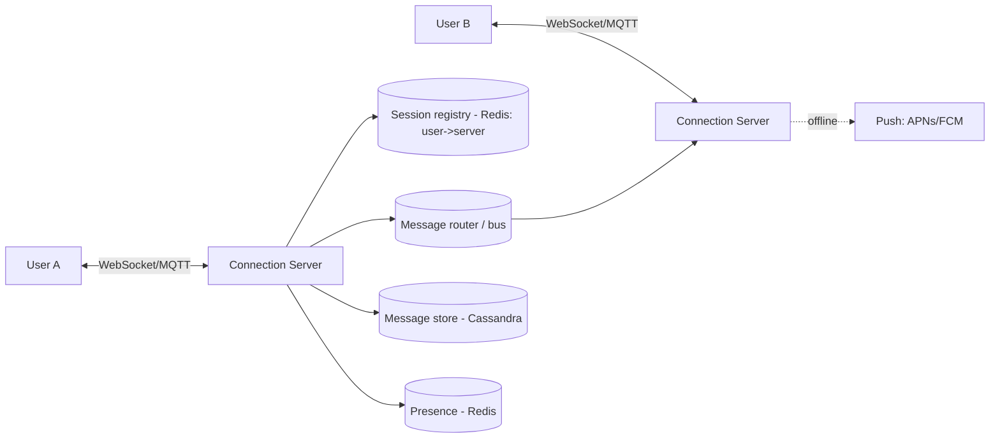
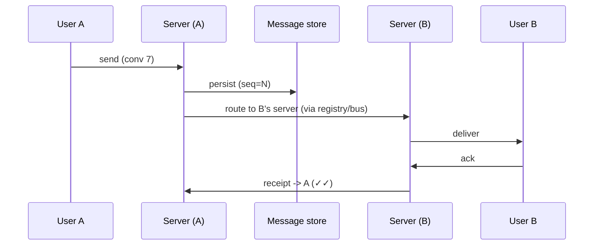

# Case Study: Chat System (WhatsApp / Messenger)

> Design a real-time messaging system supporting 1:1 and group chat, online presence,
> delivery receipts, and offline message delivery.

## 1. Requirements

**Clarifying questions**
- 1:1 only or groups? Max group size? Media/voice/video?
- History retention — forever or limited? End-to-end encryption? Multi-device?
- Receipts (sent/delivered/read) and typing indicators?

**Functional requirements**
1. Send/receive messages in real time (1:1 and group).
2. **Online/last-seen presence**.
3. **Delivery + read receipts**.
4. **Offline delivery** — store for offline users, deliver on reconnect + push
   notification.
5. Message history retrieval (scroll back).

**Non-functional requirements** (with concrete targets)
| Requirement | Target | Why |
| --- | --- | --- |
| Delivery latency | **< 100 ms** in-region | real-time feel |
| Concurrent connections | **100M+** persistent | most DAU stay connected |
| Ordering | **per-conversation, monotonic** | messages must read in order |
| Availability | **99.99%** | messaging is critical |
| Durability | **no lost messages** | losing a message is unacceptable |
| Delivery guarantee | **at-least-once + dedup** | exactly-once is impractical |

**Scale assumptions** — 500M DAU, ~40 msgs/user/day (20B/day), large fraction online
simultaneously.

**Out of scope (or note as extensions)** — voice/video calling transport, full E2E
crypto protocol details, spam/abuse.

**🎯 The dominant requirement:** **real-time delivery over hundreds of millions of
stateful connections, reliably.** The design centers on managing persistent connections
and routing a message to wherever the recipient currently is — online or offline.

## 2. Capacity estimation
- **20B messages/day** ≈ **230K writes/s** avg, much higher at peak.
- **100M+ concurrent connections**; one server handles ~100K–1M → thousands of
  connection servers.
- Storage: 20B × ~200 B ≈ **4 TB/day** (before media).

## 3. High-level architecture

## 4. Data model & API
- `messages`: `message_id (snowflake), conversation_id, sender_id, content, created_at,
  seq, status` — **partitioned by `conversation_id`**, clustered by `seq`.
- `participants`: `conversation_id, user_id, last_read_seq`.
- **Wide-column store** (Cassandra/ScyllaDB) for write volume + recent-message reads.

**Protocol** — persistent **WebSocket** (or **MQTT**, used by WhatsApp for low mobile
overhead).

---

## 5. Deep analysis — biggest problems & solutions

### 🔴 Problem 1 — Routing a message across 100M+ stateful connections
**Why it's hard:** users A and B are connected to *different* servers among thousands.
Connection servers are **stateful** (they hold sockets), so you can't just load-balance
statelessly — you must find which server holds the recipient and deliver there.

**Solution — a session registry + message bus.** A Redis-backed registry maps
`user_id → connection_server`. To deliver, look up the recipient's server and forward the
message there (directly or via a pub/sub bus); that server pushes it down the open
socket.

**How it works:**

Servers register/deregister users on connect/disconnect; on server failure, clients
reconnect and re-register elsewhere.

### 🔴 Problem 2 — Message ordering & deduplication
**Why it's hard:** messages may arrive out of order or be redelivered (at-least-once),
but a conversation must read in a single consistent order.

**Solution — a monotonic sequence number per conversation.** Assign `seq` on persist;
clients order by `seq` and drop duplicates by `message_id`. Only **per-conversation**
ordering is needed (cheap), not global ordering.

### 🔴 Problem 3 — Delivering to offline users (+ receipts)
**Why it's hard:** the recipient may be offline; the message must not be lost and should
arrive when they return, plus the sender wants delivery/read status.

**Solution — store-and-forward + push.** Persist every message immediately. If the
recipient is offline (registry miss), queue it for delivery on reconnect and trigger a
**push notification** (APNs/FCM). Track status transitions **sent → delivered → read**
via acks; update `last_read_seq` per participant for read receipts.

### 🔴 Problem 4 — Presence at scale
**Why it's hard:** naively broadcasting every user's online/offline change to all their
contacts is a fan-out storm.

**Solution — heartbeats + TTL + scoped fan-out.** Clients send periodic heartbeats;
Redis stores `user_id → {status, last_seen}` with a TTL (missed heartbeats → offline).
Only fan out presence changes to contacts **currently viewing** the user (subscribe on
chat open), not all contacts.

### 🔴 Problem 5 — Storing trillions of messages with fast reads
**Why it's hard:** enormous write volume plus "load the last N messages in this
conversation" reads; relational DBs and naive partitioning create hot partitions and slow
scans (see [Discord](./companies/discord.md)).

**Solution — wide-column store partitioned by `(conversation_id, time_bucket)`.** Bounds
partition size, keeps messages time-ordered for efficient recent-message reads, and ages
old buckets out cleanly. Media goes to object storage; the message holds only the URL.

---

## 6. Trade-offs & bottlenecks (summary)
- Stateful connections → session registry + bus; connection servers scale by socket
  count.
- **Per-conversation** ordering (cheap) vs global (unnecessary).
- At-least-once + dedup (practical) vs exactly-once (hard).
- Presence fan-out scoped to active viewers to avoid storms.
- Hot partitions for very active chats → time-bucketed partitions.

## 7. References
- [How Discord stores trillions of messages](https://discord.com/blog/how-discord-stores-trillions-of-messages)
- [WhatsApp / MQTT architecture talks](https://highscalability.com/)
- *Designing Data-Intensive Applications*
