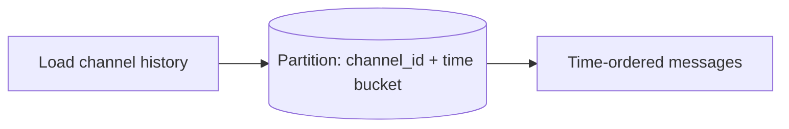

# How Discord Built It — Storing Trillions of Messages

> How Discord scaled its message storage from MongoDB → Cassandra → ScyllaDB to handle
> trillions of messages, and how it serves real-time chat to millions of concurrent
> users.

## The challenge
Store an ever-growing history of **trillions of messages**, read them fast (people
scroll back), and deliver real-time chat/voice to millions of concurrent users in
shared servers ("guilds").

## Key architectural decisions

**1. Storage evolution (the headline story)**
- **MongoDB** (early) — fine until the working set outgrew RAM and it couldn't keep up.
- **Cassandra** — moved messages here (~2017). Great write scalability, but they hit
  pain: **hot partitions**, expensive **tombstones** (deletes), and unpredictable
  latency from JVM **garbage collection** and compaction.
- **ScyllaDB** (~2022) — a C++ Cassandra-compatible rewrite with no GC and better tail
  latency. Discord migrated trillions of messages to it, cutting node count and tail
  latencies dramatically.

**2. Message data modeling**
Messages are partitioned by **(channel_id, bucket)** where a bucket is a time window, so
a partition holds a bounded, time-ordered slice — enabling efficient "load recent
messages in this channel" reads and avoiding unbounded partitions.

**3. Data services to tame hot partitions**
Discord put an intermediary **data services** layer (in Rust) in front of the database
that **coalesces** concurrent requests for the same hot partition — if thousands ask
for the same popular channel at once, it does **one** DB query and fans the result back
out. This protects the DB from thundering herds.

**4. Real-time delivery**
Persistent **WebSocket** gateways push events; an Elixir/Erlang stack handles the
massive number of concurrent connections and fan-out to guild members.

## Lessons
- **Your database choice will be tested by scale** — model around partitions and
  access patterns; watch tail latency, GC, and deletes.
- **Request coalescing** is a powerful guard against hot keys/thundering herds.
- Migrating petabytes/trillions of rows is a major engineering project — plan dual
  writes and careful cutover.

## References
- [How Discord Stores Trillions of Messages](https://discord.com/blog/how-discord-stores-trillions-of-messages)
- [How Discord Stores Billions of Messages](https://discord.com/blog/how-discord-stores-billions-of-messages)
