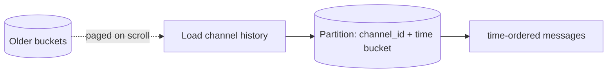

# How Discord Built It — Storing Trillions of Messages

> How Discord scaled its message storage from MongoDB → Cassandra → ScyllaDB to handle
> **trillions** of messages, and how it serves real-time chat/voice to millions of
> concurrent users.

## The challenge
Store an ever-growing history of **trillions of messages**, read them fast (users scroll
back through years of history), and deliver real-time chat and voice to millions of
concurrent users in shared servers ("guilds"), with very low and **predictable** tail
latency.

## Key architectural decisions

**1. Storage evolution (the headline story)**
- **MongoDB (early)** — fine at first, but once the working set no longer fit in RAM and
  read/write load grew, latency became unpredictable. They needed something built for
  scale.
- **Cassandra (~2017)** — moved messages here, modeling around partitions. It scaled
  writes well, but Discord hit real pain over time:
  - **Hot partitions** — a busy channel's partition gets hammered.
  - **Tombstones** — deletes/edits create tombstones that make reads scan dead data and
    slow down.
  - **JVM garbage collection** — GC pauses caused unpredictable **tail latency**, and
    operating large Cassandra clusters required dedicated effort.
- **ScyllaDB (~2022)** — a **C++**, Cassandra-compatible rewrite with a shard-per-core
  architecture and **no JVM/GC**. Discord migrated **trillions** of messages onto it,
  drastically cutting tail latencies and shrinking the cluster from ~177 Cassandra nodes
  to far fewer ScyllaDB nodes.

**2. Message data modeling**
Messages are partitioned by **`(channel_id, bucket)`**, where a **bucket** is a fixed
time window. This bounds partition size and keeps messages **time-ordered** within a
partition, so "load the most recent messages in this channel" is an efficient, bounded
read — and old buckets age out cleanly.

**3. Data services layer to tame hot partitions**
Discord put an intermediary **"data services"** layer (written in **Rust**) between the
API and the database. Its key trick is **request coalescing**: if thousands of users
request the *same* hot channel/partition at once, the data service issues **one**
database query and **fans the single result back out** to all waiters. This shields the
database from thundering herds on viral channels — a powerful, reusable pattern.

**4. Real-time delivery (Elixir/Erlang)**
The real-time gateway that pushes events over **WebSockets** is built on the **Elixir /
Erlang BEAM** VM, which excels at massive numbers of lightweight concurrent processes —
ideal for millions of persistent connections and per-guild fan-out. Discord has written
extensively about pushing this to handle very large guilds.

## Lessons
- **Your database choice gets stress-tested by scale** — model around **partitions** and
  access patterns; watch **tail latency, GC, deletes/tombstones, and hot partitions**.
- **Request coalescing** is a strong defense against hot keys / thundering herds.
- **Right runtime for the job** — Rust for hot data services, Elixir/BEAM for massive
  concurrency.
- **Migrating trillions of rows** is a major project: dual-write, backfill, verify,
  and cut over carefully.

## References
- [How Discord Stores Trillions of Messages](https://discord.com/blog/how-discord-stores-trillions-of-messages)
- [How Discord Stores Billions of Messages](https://discord.com/blog/how-discord-stores-billions-of-messages)
- [Discord Engineering blog](https://discord.com/category/engineering)
