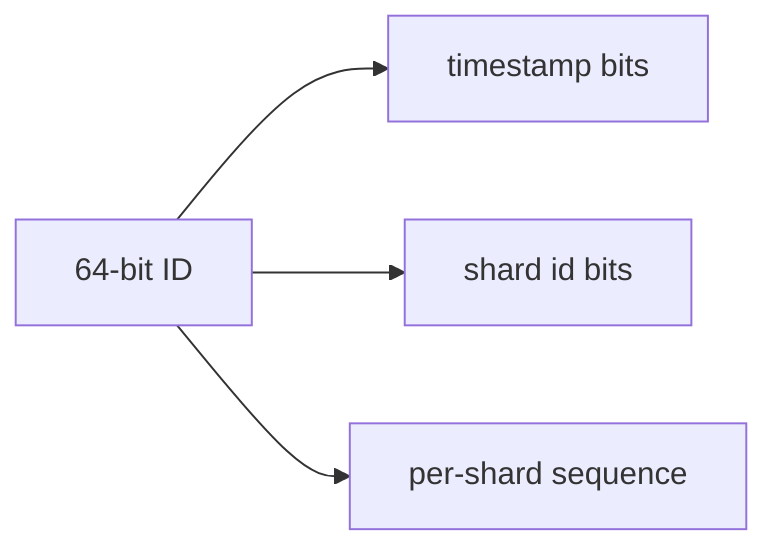

# How Instagram Built It — Feed & Storage at Scale

> How Instagram scaled to hundreds of millions of users with a famously small
> engineering team, keeping the stack simple.

## The challenge
Serve photos and a personalized feed to hundreds of millions of users, with a tiny team
(13 engineers when acquired for $1B in 2012) — favoring **simplicity and proven
technology** over novelty.

## Key architectural decisions

**1. "Keep it very simple" + proven tech**
Instagram's stated principles: *keep things simple, don't reinvent the wheel, use proven
solid technologies.* The early stack was just **Django (Python)**, **PostgreSQL**,
**Redis**, **Memcached**, and **Nginx** on AWS — scaled hard rather than rearchitected
prematurely.

**2. Sharding PostgreSQL by user ID**
As data grew they **sharded Postgres** across many logical shards mapped onto fewer
physical machines. IDs are generated to **embed the shard + timestamp** (a custom
64-bit ID scheme), so an ID tells you which shard it lives on and is roughly time-
sortable — no central ID server needed.

**3. Photo storage + CDN**
Photos live in **object storage (S3)** and are served via **CDN (CloudFront)**; the
database stores only metadata and URLs. This keeps the DB small and reads cheap.

**4. Feed: push-based fan-out + Redis**
The feed uses **fan-out on write** for most users (push new post IDs into followers'
feeds, held in **Redis**), with hybrid handling for very-high-follower accounts —
similar to the [news feed](../news-feed.md) push/pull trade-off.

**5. Caching everywhere**
Aggressive **Memcached/Redis** caching of feeds, counts, and hot objects keeps Postgres
load manageable; counts and other heavy aggregates are cached/denormalized.

## Lessons
- **Boring, proven technology scales further than you think** when used well.
- **Embed routing info in IDs** to shard without a central bottleneck.
- Store blobs in object storage + CDN; keep the relational DB for metadata.

## References
- [Instagram Engineering Blog](https://instagram-engineering.com/)
- [Sharding & IDs at Instagram](https://instagram-engineering.com/sharding-ids-at-instagram-1cf5a71e5a5c)
