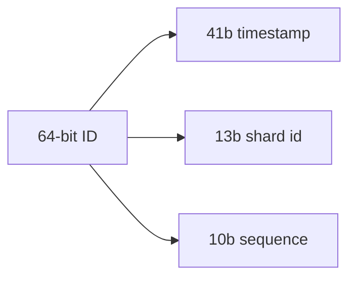

# How Instagram Built It — Feed & Storage at Scale

> How Instagram scaled to hundreds of millions of users with a famously small
> engineering team, by keeping the stack simple and proven.

## The challenge
Serve photos and a personalized feed to hundreds of millions of users — with a **tiny
team** (13 engineers when Facebook acquired it for $1B in 2012, after reaching tens of
millions of users) — favoring **simplicity and battle-tested technology** over novelty.

## Key architectural decisions

**1. "Keep it very simple" + proven tech**
Instagram's stated engineering principles: *keep things very simple, don't reinvent the
wheel, use proven solid technologies.* The early stack was deliberately boring and
scaled hard rather than rearchitected:
- **Django (Python)** application servers behind **Nginx**, on AWS.
- **PostgreSQL** as the primary datastore.
- **Redis** (feeds, sessions, activity) and **Memcached** (caching).
- Later **Cassandra** for some high-write workloads.

**2. Sharding PostgreSQL by user ID**
As data outgrew one database, Instagram **sharded Postgres** into **thousands of logical
shards** mapped onto a smaller number of physical machines (logical shards can be moved
between machines as you grow, without changing the sharding logic).

**3. Custom 64-bit IDs that embed the shard**
Instead of a central ID generator (a bottleneck), Instagram generates **64-bit IDs** that
pack:
```
[ 41 bits: timestamp (ms since epoch) ][ 13 bits: logical shard id ][ 10 bits: per-shard sequence ]
```
So an ID is **roughly time-sortable** *and* tells you **which shard** the row lives on —
no lookup service, no single counter. IDs are generated **inside Postgres** with a stored
procedure per shard.


**4. Photos in object storage + CDN**
Photos live in **S3** and are served via **CDN (CloudFront)**; the database stores only
**metadata and URLs**. This keeps the relational DB small and makes reads cheap and
globally fast — the standard blob pattern.

**5. Feed: push-based fan-out on Redis**
The feed uses **fan-out on write** for most users — when you post, the photo ID is pushed
into followers' feed lists held in **Redis** — so feed reads are fast lookups. Very-high-
follower accounts get hybrid handling, the same **push/pull trade-off** as the
[news feed](../news-feed.md) design.

**6. Caching everywhere**
Aggressive **Memcached/Redis** caching of feeds, counts, sessions, and hot objects keeps
Postgres load manageable. Heavy aggregates (like counts) are cached/denormalized rather
than computed on every read.

## Lessons
- **Boring, proven technology scales further than you think** when used carefully — you
  don't need exotic databases to reach hundreds of millions of users.
- **Embed routing info in your IDs** to shard without a central bottleneck, and get
  time-sortability for free.
- **Blobs in object storage + CDN; relational DB for metadata only.**
- A small team can scale enormously by **minimizing moving parts** and caching hard.

## References
- [Instagram Engineering Blog](https://instagram-engineering.com/)
- [Sharding & IDs at Instagram](https://instagram-engineering.com/sharding-ids-at-instagram-1cf5a71e5a5c)
- [What powers Instagram (early architecture)](https://instagram-engineering.com/what-powers-instagram-hundreds-of-instances-dozens-of-technologies-adf2e22da2ad)
